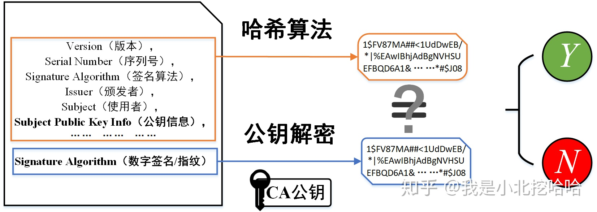
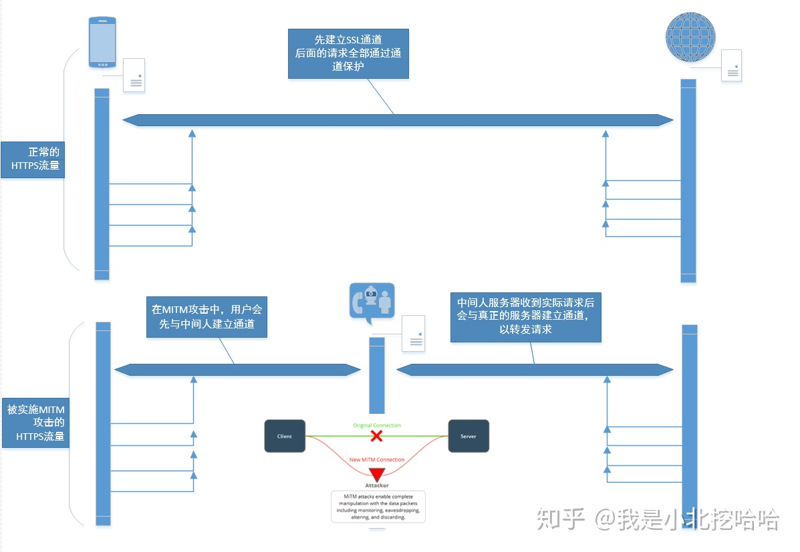

该问题缘起如下代码：

该代码意即请求 HTTPS 站点，然该站点的证书并非通过权威 CA 认证，所以跳过证书验证。

## 证书简介

通常证书即指数字证书、(CA)证书、HTTPS证书、SSL/TLS证书，直接点说就是CA签发的数字证书。

数字证书=主体信息+数字签名。

数字证书通常由四部分组成。由打开 chrome 打开一个可信赖的站点，可以看到证书：

打开证书顶部会看到证书连，即由根证书到该证书的颁发链条。

其次会看到 Subject(使用者)、Issuer(颁发者，即颁发该证书的 CA)、PublicKeyInfo(公钥信息)、Fingerprints(数字签名)四个部分。

注意该证书由 CA 颁发，即最后的数字签名由 CA 生成。

CA 生成数字签名的规则如下：

>有些地方的描述提到了“摘要”，即上面非签名部分，将“摘要”计算hash指之后再用 ca 私钥加密，得到签名。

该签名即一个防伪标识，在证书验证阶段能够确保“防伪”。

## 证书验证

在客户端与服务端建立 HTTPS 连接时，服务端会向客户端返回证书。

客户端收到对端发过来的证书需要进行证书验证，用于验证客户端从服务端拿到的证书是合法的，从而能够验证服务端的身份。

具体过程图示如下：

1. 客户端拿到证书后对其“摘要”进行哈希映射，得到的散列值记作 H1；
2. 从系统内置的 CA 颁发的真实证书中取出数字签名，然后使用 CA 的公钥对数字签名进行解密，得到的散列值记作 H2；
3. 对比H1和H2两个字符串是否严格相等，若是，代表该证书的信息未被篡改，证书有效；否则，证书内容被篡改，证书无效；
4. 若证书有效，客户端会拿**证书上的公钥（也是对端自己生产的非对称加密公钥**加密接下来整个TLS握手阶段的信息之后，发送给对端。

注意上面出现了两个公钥，一个是CA公钥，一个是证书上的公钥，两者不同。

**CA机构的公钥怎么获取？**

提前内置。操作系统和浏览器在软件安装阶段会在其特定目录下放置一堆的证书。

这些证书中有一类特别的证书是根证书，根证书上的公钥即上文提到的 CA 公钥。在服务端返回的证书中，有一部分是颁发链条，颁发链条的顶端就是根证书。

## 后果

若跳过证书验证阶段，则可能会出现中间人攻击的情况。

也就是说一开始的代码存在一定的攻击风险。

---

实现请参考 [go-https](https://github.com/Frank588/go-https)（未验证）。

参考：
- https://zhuanlan.zhihu.com/p/105232920