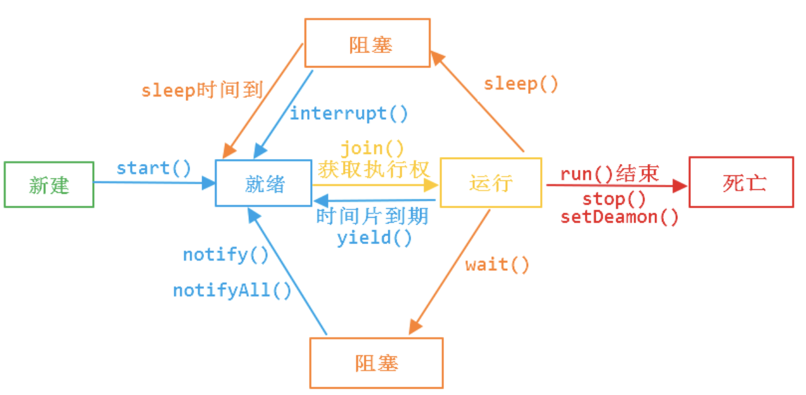

# 进程状态

开始(新建)、就绪、运行、等待（阻塞）、终止（死亡）

# 进程间通信方式

https://blog.csdn.net/zhaohong_bo/article/details/89552188

1. 管道

    两个进程利用管道进行通信时．发送信息的进程称为写进程．接收信息的进程称为读进程。管道通信方式的中间介质就是文件．通常称这种文件为管道文件。

    无名管道是一种非永久性的管道通信机构．当它访问的进程全部终止时，它也将随之被撤消。
    无名管道只能用在具有家族联系的进程之间。无名管道只存在于内存中的文件。
    
    命名管道是存在于实际的磁盘介质或者文件系统，可以长期存在于系统之中．而且提供给任意关系的进程使用，但是使用不当容易导致出错。

2. 消息队列（消息缓冲）

    消息队列是存放在内核中的消息链表，每个消息队列由消息队列标识符表示。

    与管道不同的是消息队列存放在内核中，只有在内核重启(即操作系统重启)或者显示地删除一个消息队列时，该消息队列才会被真正的删除。

    另外与管道不同的是，消息队列在某个进程往一个队列写入消息之前，并不需要另外某个进程在该队列上等待消息的到达。

    对每个消息指定特定的消息类型，接收的时候不需要按照队列次序，而是可以根据自定义条件接收特定类型的消息。可以把消息看做一个记录，具有特定的格式以及特定的优先级。对消息队列有写权限的进程可以向消息队列中按照一定的规则添加新消息，对消息队列有读权限的进程可以从消息队列中读取消息。

3. 信号

    信号是 Linux 系统中用于进程间互相通信或者操作的一种机制，信号可以在任何时候发给某一进程，而无需知道该进程的状态。

    信号是软件层次上对中断机制的一种模拟，是一种异步通信方式，信号可以在用户空间进程和内核之间直接交互，内核可以利用信号来通知用户空间的进程发生了哪些系统事件。

4. 信号量

    信号量是一个计数器，用于多进程对共享数据的访问，信号量的意图在于进程间同步。

    注意和互斥锁的区别，信号量更倾向于同步，比如 wait-group

5. 共享内存

    使得多个进程可以可以直接读写同一块内存空间，是最快的可用IPC形式。是针对其他通信机制运行效率较低而设计的。

    进程可以直接读写这一块内存而不需要进行数据的拷贝，从而大大提高效率。

    由于多个进程共享一段内存，因此需要依靠某种同步机制（如信号量）来达到进程间的同步及互斥。

6. socket

    微服务。