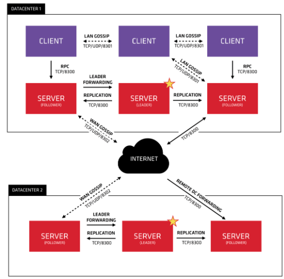

---

## Agent

可以以 server mode 或 client mode 运行。所有的 agents 能运行 DNS 或 HTTP 接口，并且负责健康检查以及服务状态同步。通常，运行在 client mode 下的 agent 称为 client，运行在 server mode 下的 agent 称为 server。

client mode: 向 server 发 RPC 请求进行状态同步；参与 LAN gossip pool

server mode: 参加 Raft 相关行为； 响应 client 的 RPC 请求；与其他 Datacenters 交换 WAN gossip 信息；

---

## Consensus 一致性

运行在 server mode 下的多个 agents 需要一致性协议同步状态。 consul 使用 raft 协议。

---

## Gossip

consul 使用 [serf 库](https://github.com/hashicorp/serf) 和 [memberlist 库](https://github.com/hashicorp/memberlist) 实现 gossip。

gossip 主要包括基于 UDP 的随机的点对点通信。

LAN Gossip：同一个 Datacenter 下的节点间的 gossip pool；

WAN Gossip：不通 Datacenters 间的服务器节点间的 gossip pool；

---

参考：
- https://www.consul.io/docs/architecture
- https://github.com/hashicorp/consul/tree/v1.8.5