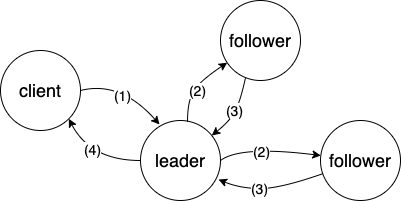

Raft 是一种强一致性协议。注意是 consul 中 raft 指 servers 间的协议，与 client 无关。

当 consul server 收到 consul client 转发的请求或者同步过来的信息时，consul servers 内部需要保持一致，这就是 raft 的作用。

---

## Raft 的几个关键概念：

**Log** - 行为序列（ordered sequence of entries）。Entry 包括所有的集群行为：添加节点、注册服务、写kv对等等。

<!-- FSM -  -->

**Peer set** - 参与 log replication 的所有成员，即所有 servers。

**Quorum** - 法定人数。对于 N 来说，`quorum = (N / 2) + 1`，即刚刚超过半数的 servers 数量。
>即当 servers 只有 2 个时，quorum 也为 2，则当其中一个不可用时，整个系统则无法达到 quorum 数，将无法更新集群状态，同时，考虑同步性能，推荐 server 数为 3 或者 5 个。为什么不是不推荐 4 个？因为 4 个和 3 个一样，都只能容错一台节点错误。
>为什么不用偶数个节点？（面试高频题）1. 和奇数节点容错节点相同（如上，4个节点和3个节点容错节点数相同）；2. 偶数节点选举性能更差，4个节点会出现2票对2票的情况，需要更多的时间得到选举结果。


**Committed Entry** - 达到 quorum 数的 server 收到了某个 entry，则称这个 entry 为 committed entry。

<!-- Leader -  -->

**Term** - 任期。每个 Term 都是一个连续递增的编号，每一轮选举都是一个 Term 周期，在一个 Term 中只能产生一个 leader。

Raft 的节点一共有三种角色：leader、follower、candidate。所有的 server 一开始都是 follower 。

正常情况下 follower 从 leader 处接收 entry，如果超过一定时间没有接收到 entry，则暗示着 leader 有可能出问题，则该 follower 自动成为 candidate。注意，当 follower 接收到 client 的 RPC 请求，follower 不进行处理，而是转发给 leader 进行处理。

在 candidate 状态下，可以请求其他的节点给自己投票。当票数达到 quorum 时，就转变为 leader 状态。

在 leader 状态下，需要处理 log。如果是读请求，则 leader 根据当前状态返回所需结果，如果是写请求，则生成一个新的 log 并且开始同步，直到 这个 log 被 committed（达到 quorum 数节点收到） 并且 applied（写入状态机）则写完成。

---

## 一致性模式

default - 只允许 leader 节点响应请求，但是当 leader 节点变更时，可能会出现两个 leader ，在这种情况下，老 leader 响应的可能是脏数据。

consistent - 强一致性但是最慢，leader 在响应读请求时，需要遍历其他节点确保自己是 leader。

stale - 允许非 leader 节点响应读请求。速度最快，但是值有可能是过期的（通常不会超过50ms过期）。

---

## 关键过程

raft 主要包括 *Leader Election* 和 *Log Replication* 两个关键步骤。

**Leader Election**

心跳超时（heartbeat timeout) - follower 与 leader 进行通信的最大时间间隔。

<!-- 即如果心跳超时，则 follower 会成为 candidate 进行选举。 -->

选举超时（election timeout) - candidate 收到每张选票的最大时间间隔。

<!-- 即 candidate 如果在选举阶段内，没有收到下一个节点的投票，则重新开始请求投票。 -->

当 follower 心跳超时，会成为 candidate 进行选举开始选举。candidate 会向每个节点请求投票（request votes），若出现选举超时，则重新开始请求投票；若收到法定人数的计票则成为 leader。注意 candidate 会在开始请求投票之前给自己投一票，即只需（法定人数 - 1）张票即可。

注意当 candidate 和 leader 接收到新 term 的请求时，都会退化为 follower。


**Log Replication**

leader 需要向其他节点同步操作，即 log replication 过程，该过程通过 append entry 指令发出。当有法定数节点（包括 leader 自身）感知到状态更新后，即称为该 log 为 committed。

所以一个有 3 个和 4 个 servers 的 raft 集群，容错节点数都为 1 个节点。

一次完整 Log Replication 如下进行：

1. client 请求 leader 更新状态；
2. leader 向其他节点发出 append entry 指令；
3. 其他节点相应指令并成功返回给 leader；
4. 当 leader 发现 log 已 committed，即返回给 client；



---

## 实现

当 agent 运行在 server mode 下时会初始化 raft 实例：
<!-- 
`agent/agent.go`

```golang
func (a *Agent) Start(ctx context.Context) error {
    // ...

    // Setup either the client or the server.
    if c.ServerMode {
        server, err := consul.NewServer(consulCfg, options...)
        if err != nil {
            return fmt.Errorf("Failed to start Consul server: %v", err)
        }
        a.delegate = server
    } else {
        // ...
    }

    // ...
}
```

`agent/consul/server.go`

```golang
// NewServer is used to construct a new Consul server from the configuration
// and extra options, potentially returning an error.
func NewServer(config *Config, options ...ConsulOption) (*Server, error) {
    // ...

    // Initialize the Raft server.
    if err := s.setupRaft(); err != nil {
        s.Shutdown()
        return nil, fmt.Errorf("Failed to start Raft: %v", err)
    }

    // ...
}
``` -->


<!-- `agent/consul/server.go`

```golang
// setupRaft is used to setup and initialize Raft
func (s *Server) setupRaft() error {
    // ...

    // Create the FSM.
    var err error
    s.fsm, err = fsm.New(s.tombstoneGC, s.logger)
    if err != nil {
        return err
    }

    // ...

    // Setup the Raft store.
    s.raft, err = raft.NewRaft(s.config.RaftConfig, s.fsm.ChunkingFSM(), log, stable, snap, trans)
    if err != nil {
        return err
    }
    return nil
}
``` -->


`https://github.com/hashicorp/raft`


```golang
func NewRaft(conf *Config, fsm FSM, logs LogStore, stable StableStore, snaps SnapshotStore, trans Transport) (*Raft, error) {
    // ...
   
    // 初始化为 follower
    r.setState(Follower)

    // Start as leader if specified. This should only be used
    // for testing purposes.
    if conf.StartAsLeader {
        r.setState(Leader)
        r.setLeader(r.localAddr)
    }

    // ...

    // Start the background work.
    r.goFunc(r.run)
    r.goFunc(r.runFSM)
    r.goFunc(r.runSnapshots)
    return r, nil
}
```

重点关注 `r.goFunc(r.run)` 中的 run 方法：


```golang
// run is a long running goroutine that runs the Raft FSM.
func (r *Raft) run() {
    for {
        // Check if we are doing a shutdown
        select {
        case <-r.shutdownCh:
            r.setLeader("")
            return
        default:
        }

        // 根据节点当前角色运行对应的处理函数
        switch r.getState() {
        case Follower:
            r.runFollower()
        case Candidate:
            r.runCandidate()
        case Leader:
            r.runLeader()
        }
    }
}
```

对于 follower 来说需要处理心跳超时：

```golang
// runFollower runs the FSM for a follower.
func (r *Raft) runFollower() {
    didWarn := false
    r.logger.Info("entering follower state", "follower", r, "leader", r.Leader())
    metrics.IncrCounter([]string{"raft", "state", "follower"}, 1)
    heartbeatTimer := randomTimeout(r.conf.HeartbeatTimeout)

    for r.getState() == Follower {
        select {
        case rpc := <-r.rpcCh:
            r.processRPC(rpc) // setLastContact

        // ...

        case a := <-r.applyCh:
            // Reject any operations since we are not the leader
            a.respond(ErrNotLeader)

        case <-heartbeatTimer: // 心跳超时
            // 重置随机 timeout，避免同时进行选举
            heartbeatTimer = randomTimeout(r.conf.HeartbeatTimeout) 

            // Check if we have had a successful contact
            lastContact := r.LastContact() // 上一次和 leader 通信的时刻
            if time.Now().Sub(lastContact) < r.conf.HeartbeatTimeout {
                continue
            }
            
            r.setLeader("") // 至此， leader 通信失败，置空 leader

            r.setState(Candidate) // 转为 candidate 角色，跳出循环

        case <-r.shutdownCh:
            return
        }
    }
}
```

其中的 processRPC 方法会执行 append entry 等指令：

```golang
func (r *Raft) processRPC(rpc RPC) {
    if err := r.checkRPCHeader(rpc); err != nil {
        rpc.Respond(nil, err)
        return
    }

    switch cmd := rpc.Command.(type) {
    case *AppendEntriesRequest: // 适用于 follower 的 append entry
        r.appendEntries(rpc, cmd)
    case *RequestVoteRequest: // candidate 请求投票
        r.requestVote(rpc, cmd)
    case *InstallSnapshotRequest:
        r.installSnapshot(rpc, cmd)
    case *TimeoutNowRequest:
        r.timeoutNow(rpc, cmd)
    default:
        r.logger.Error("got unexpected command",
            "command", hclog.Fmt("%#v", rpc.Command))
        rpc.Respond(nil, fmt.Errorf("unexpected command"))
    }
}
```

针对 candidate 来说需要处理选举超时：

```golang
// runCandidate runs the FSM for a candidate.
func (r *Raft) runCandidate() {
    r.logger.Info("entering candidate state", "node", r, "term", r.getCurrentTerm()+1)
    metrics.IncrCounter([]string{"raft", "state", "candidate"}, 1)

    // 开始请求其他节点给自己投票，注意自己会给自己投一票
    voteCh := r.electSelf()

    electionTimer := randomTimeout(r.conf.ElectionTimeout)

    // Tally the votes, need a simple majority
    grantedVotes := 0
    votesNeeded := r.quorumSize() // 法定人数即超过半数节点数
    r.logger.Debug("votes", "needed", votesNeeded)

    for r.getState() == Candidate {
        select {
        case rpc := <-r.rpcCh:
            r.processRPC(rpc)

        case vote := <-voteCh:
            // 如果发现有更新的 term 则退化为 follower
            if vote.Term > r.getCurrentTerm() {
                r.logger.Debug("newer term discovered, fallback to follower")
                r.setState(Follower)
                r.setCurrentTerm(vote.Term)
                return
            }

            // Check if the vote is granted
            if vote.Granted {
                grantedVotes++
                r.logger.Debug("vote granted", "from", vote.voterID, "term", vote.Term, "tally", grantedVotes)
            }

            // 成功当选为 leader
            if grantedVotes >= votesNeeded {
                r.logger.Info("election won", "tally", grantedVotes)
                r.setState(Leader)
                r.setLeader(r.localAddr)
                return
            }

        case a := <-r.applyCh:
            a.respond(ErrNotLeader)


        case <-electionTimer: // 选举超时
            r.logger.Warn("Election timeout reached, restarting election")
            return

        case <-r.shutdownCh:
            return
        }
    }
}
```

<!-- 
`github.com/hashicorp/raft/fsm.go`

```golang
type FSM interface {
    // 提交日志条目
    Apply(*Log) interface{}

    // 截取当前状态快照
    Snapshot() (FSMSnapshot, error)

    // 从快照中恢复 FSM 状态
    Restore(io.ReadCloser) error
}

// runFSM is a long running goroutine responsible for applying logs
// to the FSM. This is done async of other logs since we don't want
// the FSM to block our internal operations.
func (r *Raft) runFSM() {
    var lastIndex, lastTerm uint64

    commit := func(req *commitTuple) {
        // ...

        // Apply the log if a command or config change
        var resp interface{}
        // Make sure we send a response
        defer func() {
            // Invoke the future if given
            if req.future != nil {
                req.future.response = resp
                req.future.respond(nil)
            }
        }()
    
        resp = r.fsm.Apply(req.log)


        // Update the indexes
        lastIndex = req.log.Index
        lastTerm = req.log.Term
    }

    restore := func(req *restoreFuture) {
        // 打开快照
        meta, source, err := r.snapshots.Open(req.ID)
        if err != nil {
            req.respond(fmt.Errorf("failed to open snapshot %v: %v", req.ID, err))
            return
        }

        // 开始恢复
        if err := r.fsm.Restore(source); err != nil {
            req.respond(fmt.Errorf("failed to restore snapshot %v: %v", req.ID, err))
            source.Close()
            return
        }
 
        // Update the last index and term
        lastIndex = meta.Index
        lastTerm = meta.Term
        req.respond(nil)
    }

    snapshot := func(req *reqSnapshotFuture) {
        // ...

        // 截取快照
        snap, err := r.fsm.Snapshot()

        // Respond to the request
        req.index = lastIndex
        req.term = lastTerm
        req.snapshot = snap
        req.respond(err)
    }

    for {
        select {
        case ptr := <-r.fsmMutateCh:
            switch req := ptr.(type) {
            case []*commitTuple:
                commitBatch(req)

            case *restoreFuture:
                restore(req)

            default:
                panic(fmt.Errorf("bad type passed to fsmMutateCh: %#v", ptr))
            }

        case req := <-r.fsmSnapshotCh:
            snapshot(req)

        case <-r.shutdownCh:
            return
        }
    }
}
``` 

`github.com/hashicorp/raft/snapshot.go`

```golang
// runSnapshots is a long running goroutine used to manage taking
// new snapshots of the FSM. It runs in parallel to the FSM and
// main goroutines, so that snapshots do not block normal operation.
func (r *Raft) runSnapshots() {
    for {
        select {
        case <-randomTimeout(r.conf.SnapshotInterval):
            // Check if we should snapshot
            if !r.shouldSnapshot() {
                continue
            }

            // Trigger a snapshot
            if _, err := r.takeSnapshot(); err != nil {
                r.logger.Error("failed to take snapshot", "error", err)
            }

        case future := <-r.userSnapshotCh:
            // User-triggered, run immediately
            id, err := r.takeSnapshot()
            if err != nil {
                r.logger.Error("failed to take snapshot", "error", err)
            } else {
                future.opener = func() (*SnapshotMeta, io.ReadCloser, error) {
                    return r.snapshots.Open(id)
                }
            }
            future.respond(err)

        case <-r.shutdownCh:
            return
        }
    }
}
``` -->

---

参考：
- https://www.consul.io/docs/architecture/consensus
- http://thesecretlivesofdata.com/raft
- https://raft.github.io/