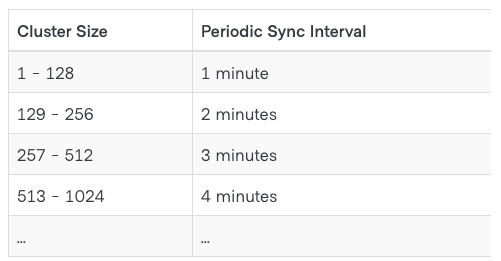

逆熵（anti-entropy） 指的是 agent 本地定期向 consul server 同步信息，以及拉取 consul server 中的信息然后合并的过程。

<!-- 而 servers 如何保持状态一致属于接下来“一致性协议”要讨论的内容，servers保持一致后如何将该变化信息让整个consul集群都知道，属于接下来“gossip绯闻传播协议”的内容。 -->

熵是系统变得越来越无序的趋势。consul 的逆熵机制旨在对抗这种趋势，即使在组件发生故障的情况下也能保持集群的有序状态。


<!-- --- -->

<!-- ## 关键概念

**agent** - consul agent 维护着自己

**catalog** 

consul 的服务发现信息存储在 catalog 中。catalog 是所有 agent 信息的综合，是集群信息的高级api，包括了服务的可用性，服务的节点信息以及健康信息等等。通过 http 和 dns 接口暴露给外部。

catalog 只被 consul server 维护，因为 catalog 信息 -->

有两个关键概念需要区分：

agent - 即 consul agent，agent 中的信息由 consul client 自己维护。

catalog - 是集群中所有 agent 中信息的抽象。catalog 中的信息由 consul servers 进行维护。

>
>比如
>
>`http://127.0.0.1:8500/v1/agent/service/wax-delivery` 得到的是注册在 `127.0.0.1` 上服务名为 wax-delivery 的节点（1个）；
>
>而 `curl http://127.0.0.1:8500/v1/catalog/service/wax-delivery` 得到的是整个集群中服务名为 wax-delivery 的节点（36个）。
>
>即当使用 `/v1/agent` 路径时，agent 会进行本地处理，然后把处理结果同步给 consul server；而当使用 `/v1/catalog` 路径时，agent 会将请求转发给 consul server，由 consul server 进行处理。
>
>换句话说，即使在某一个 consul client 所在的 agent 请求 `/v1/catalog/register` 注册某 A 服务，也不会在该 agent 的 `/v1/agent/services` 响应中包含 A 服务。


例如，当用户向 agent 注册新服务时，agent 会通知 catalog 更改。类似地，当从 agent 中注销服务时，也会同步给 catalog。

注意，agent 中的信息具有权威性。即当 agent 拉取到 server 中的信息和本地不同时，以 agent 为准。

<!-- 在此同步过程中，consul server 中的信息也会被检查。如果 consul server 中存在 agent 不存在的服务，它们将自动删除，以使目录反映该代理的正确服务和运行状况信息集。consur将代理的状态视为权威；如果代理和目录视图之间存在任何差异，则始终使用代理本地视图。 -->

---

## 实现

在 agent 启动时，会开始进行同步任务：

`cmd/agent/agent.go`


<!-- ```golang
// Let the agent know we've finished registration
agent.StartSync()
```


`agent/agent.go`


```golang
// StartSync is called once Services and Checks are registered.
// This is called to prevent a race between clients and the anti-entropy routines
func (a *Agent) StartSync() {
    go a.sync.Run()
    a.logger.Info("started state syncer")
}
``` -->

```golang
func (a *Agent) Start(ctx context.Context) error {
    // ...
    a.State = local.NewState(LocalConfig(c), a.logger, a.tokens)

    // c.AEInterval consul 内部写死 1 分钟。
    a.sync = ae.NewStateSyncer(a.State, c.AEInterval, a.shutdownCh, a.logger)
    // ...

    // Setup either the client or the server.
    if c.ServerMode {
        server, err := consul.NewServer(consulCfg, options...)
        if err != nil {
            return fmt.Errorf("Failed to start Consul server: %v", err)
        }
        a.delegate = server
    } else {
        client, err := consul.NewClient(consulCfg, options...)
        if err != nil {
            return fmt.Errorf("Failed to start Consul client: %v", err)
        }
        a.delegate = client
    }
    
    // the staggering of the state syncing depends on the cluster size.
    a.sync.ClusterSize = func() int { return len(a.delegate.LANMembers()) }
    // ...
}
```

其中 `a.State` 实现了如下的 `SyncState 接口`，即 `a.sync` 的数据存储为 `a.State`，并通过 `SyncState 接口` 提供的方法进行同步操作。

```golang
type SyncState interface {
    SyncChanges() error
    SyncFull() error
}
```

当 `a.sync` 实例化之后运行 `Run` 方法：

```golang
func (s *StateSyncer) Run() {
    if s.ClusterSize == nil {
        panic("ClusterSize not set")
    }
    s.resetNextFullSyncCh() // 
    s.runFSM(fullSyncState, s.nextFSMState)
}
```

`s.resetNextFullSyncCh` 初始化同步开始的时刻，内部使用了随机时刻，避免同时开始带来的服务器压力(thundering herd)。

```golang
func (s *StateSyncer) resetNextFullSyncCh() {
    if s.stagger != nil {
        s.nextFullSyncCh = time.After(s.Interval + s.stagger(s.Interval))
    } else {
        s.nextFullSyncCh = time.After(s.Interval)
    }
}
```

```golang
func (s *StateSyncer) staggerFn(d time.Duration) time.Duration {
    f := scaleFactor(s.ClusterSize()) // 计算基准时间 f分钟
    return libRandomStagger(time.Duration(f) * d) // 在 0秒 ～ f分钟 之间随机选一个时间
}
```

上面代码实现了官网中的“节点数 - 同步间隔”表。



<!--

[github.com/hashicorp/serf v0.9.5](https://github.com/hashicorp/serf/tree/v0.9.5)

`serf/serf.go`

```golang
func (s *Serf) Members() []Member {
    s.memberLock.RLock()
    defer s.memberLock.RUnlock()

    members := make([]Member, 0, len(s.members))
    for _, m := range s.members {
        members = append(members, m.Member)
    }

    return members
}
```

```golang
// Member is a single member of the Serf cluster.
type Member struct {
    Name   string
    Addr   net.IP
    Port   uint16
    Tags   map[string]string
    Status MemberStatus

    // The minimum, maximum, and current values of the protocol versions
    // and delegate (Serf) protocol versions that each member can understand
    // or is speaking.
    ProtocolMin uint8
    ProtocolMax uint8
    ProtocolCur uint8
    DelegateMin uint8
    DelegateMax uint8
    DelegateCur uint8
}
```

-->


```golang
// runFSM runs the state machine.
func (s *StateSyncer) runFSM(fs fsmState, next func(fsmState) fsmState) {
    for {
        if fs = next(fs); fs == doneState {
            return
        }
    }
}

// nextFSMState determines the next state based on the current state.
func (s *StateSyncer) nextFSMState(fs fsmState) fsmState {
    switch fs {
    case fullSyncState:
        if s.Paused() {
            return retryFullSyncState
        }

        err := s.State.SyncFull() // 调用 State 接口的 SyncFull 方法
        if err != nil {
            s.Logger.Error("failed to sync remote state", "error", err)
            return retryFullSyncState
        }

        return partialSyncState

    case retryFullSyncState:
        e := s.retrySyncFullEvent()
        switch e {
        case syncFullNotifEvent, syncFullTimerEvent:
            return fullSyncState
        case shutdownEvent:
            return doneState
        default:
            panic(fmt.Sprintf("invalid event: %s", e))
        }

    case partialSyncState:
        e := s.syncChangesEvent()
        switch e {
        case syncFullNotifEvent, syncFullTimerEvent:
            return fullSyncState

        case syncChangesNotifEvent:
            if s.Paused() {
                return partialSyncState
            }

            err := s.State.SyncChanges() // 调用 State 接口的 SyncChanges 方法
            if err != nil {
                s.Logger.Error("failed to sync changes", "error", err)
            }
            return partialSyncState

        case shutdownEvent:
            return doneState

        default:
            panic(fmt.Sprintf("invalid event: %s", e))
        }

    default:
        panic(fmt.Sprintf("invalid state: %s", fs))
    }
}
```


<!--

`agent/ae/ae.go`

```golang
// Pause temporarily disables sync runs.
func (s *StateSyncer) Pause() {
    s.pauseLock.Lock()
    s.paused++
    s.pauseLock.Unlock()
}

// Paused returns whether sync runs are temporarily disabled.
func (s *StateSyncer) Paused() bool {
    s.pauseLock.Lock()
    defer s.pauseLock.Unlock()
    return s.paused != 0
}

// Resume re-enables sync runs. It returns true if it was the last pause/resume
// pair on the stack and so actually caused the state syncer to resume.
func (s *StateSyncer) Resume() bool {
    s.pauseLock.Lock()
    s.paused--
    if s.paused < 0 {
        panic("unbalanced pause/resume")
    }
    trigger := s.paused == 0
    s.pauseLock.Unlock()
    if trigger {
        s.SyncChanges.Trigger()
    }
    return trigger
}
```

-->


下面是 State 的实现，即上面 SyncFull 和 SyncChanges 的实现。


`agent/local/state.go`


```golang
func (l *State) SyncFull() error {
    if err := l.updateSyncState(); err != nil {
        return err
    }
    return l.SyncChanges()
}
```

这里重点关注 `updateSyncState` 方法：

```golang
// updateSyncState does a read of the server state, and updates
// the local sync status as appropriate
func (l *State) updateSyncState() error {
    // 获取远端服务列表
    req := structs.NodeSpecificRequest{
        Datacenter: l.config.Datacenter,
        Node:       l.config.NodeName,
        QueryOptions: structs.QueryOptions{
            Token:            l.tokens.AgentToken(),
            AllowStale:       true,
            MaxStaleDuration: fullSyncReadMaxStale,
        },
        EnterpriseMeta: *structs.WildcardEnterpriseMeta(),
    }

    // 这里的 Delegate 实现可以是 client 或者 server
    // client 的实现是一次真正的远程调用
    // server 的实现其实是本地函数调用
    l.Delegate.RPC("Catalog.NodeServiceList", &req, &out1)
    for _, svc := range out1.NodeServices.Services {
        remoteServices[svc.CompoundServiceID()] = svc
    }

    // ...

    // 遍历本地服务列表
    for id, s := range l.services {
        if remoteServices[id] == nil {
            s.InSync = false // 标记本地刚注册的服务
        }
    }

    // 遍历远端服务列表，并合并到本地
    for id, rs := range remoteServices {
        ls := l.services[id] // ls => localService
        if ls == nil { // 本地没有的服务标记为已删除
            // ...
            l.services[id] = &ServiceState{Deleted: true}
            continue
        }

        if ls.Deleted {
            continue
        }

        // ...

        ls.InSync = ls.Service.IsSame(rs) // 比较本地服务是否和远端获取的这个服务相同
    }

    // ...
}
```

```golang
func (l *State) SyncChanges() error {
    // ...
    // 遍历刚合并过远程拉取信息的本地服务
    for id, s := range l.services {
        var err error
        switch {
        case s.Deleted: // 本地已删除的服务
            err = l.deleteService(id) // 从远端删除服务
        case !s.InSync: // 本地刚注册的服务还未同步到远端
            err = l.syncService(id) // 将服务添加到远端
        default:
            l.logger.Debug("Service in sync", "service", id.String())
        }
        if err != nil {
            return err
        }
    }
    // ...
    return nil
}
```


什么时候会 pause ？

<!-- `agent/agent_endpoint.go` 

```golang
func (s *HTTPServer) AgentRegisterService(resp http.ResponseWriter, req *http.Request) (interface{}, error) {
    // ...
    s.agent.AddService(...)
    // ...
}
``` -->

当向 agent 发起请求，比如注册服务时会触发 pause：

<!-- `agent/agent.go`

```golang
// addServiceInternal adds the given service and checks to the local state.
func (a *Agent) addServiceInternal(req *addServiceRequest) error {
    // ...
    // Pause the service syncs during modification
    a.PauseSync()
    defer a.ResumeSync()
    // ...

    a.State.AddServiceWithChecks(service, checks, token) // 把服务写入到 State

    // ...
}
``` -->

```golang
func (l *State) setServiceStateLocked(s *ServiceState) {
    s.WatchCh = make(chan struct{}, 1)

    key := s.Service.CompoundServiceID()
    old, hasOld := l.services[key]
    l.services[key] = s // 将新注册的服务写入到本地服务列表

    // ...
}
```

至此一个状态更新回路完成：


注意上面的 agent 指的是运行在 client mode 下的 agent，对于运行在 server mode 下的 agent 情况也是类似的，只是 RPC 的实现过程不同其余的都是一样。


---

参考：
- https://www.consul.io/docs/architecture/anti-entropy