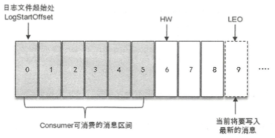

## 复制

Kafka 为分区引入了多副本（Replica) 机制，通过增加副本数量可以提升容灾能力。同一分区的不同副本中保存的是相同的消息（在同一时刻，副本之间并非完全一样）。

副本之间是“一主多从”的关系，副本处于不同的 broker 中，当 leader 副本出现故障时，从 follower 副本中重新选举新的 leader 副本对外提供服务。
>注意这里的 follower 副本不处理任何请求，无论是写请求还是读请求，都由 leader 副本处理，follower 副本只负责与 leader 副本的消息同步。

Kafka 通过多副本机制实现了故障的自动转移，当 kafka 集群中某个 broker 失效时仍然能保证服务可用。

如上是某个 topic 在集群中的生产消费图示。

集群中有 4 个 broker，该 topic 共分配 3 个 partition（P1、P2、P3），不同的 partition 被分配到不同的 broker 进行生产消费，同时每个 partion 都有 2 个 follower 在不同的 broker 分布。注意只有 3 个 leader 副本处理读写请求。

首先引入 3 个概念：

- AR: Assigned Replicas，分区中所有副本（leader + followers)
- ISR: In-Sync Replicas，所有与 leader 副本保持同步的副本（包括 leader）
- OSR: Out-of-Sync Replicas，与 leader 副本同步滞后的副本

由上定义，AR == ISR + OSR，常规情况下，所有的 follower 副本都与 leader 副本保持一致，即 OSR == 0。

默认情况下，只有在 ISR 集合中的副本才有资格被选举为新的 leader（可通过修改相应的参数配置改变）。

再引入 2 个概念：

- HW: High Watermark，高水位，即标识了消费者最远能拉取到的 offset + 1
- LEO: Log End Offset，标识当前日志文件中下一条待写入消息的 offset，即当前日志副本中最后一条消息的 offset + 1

分区 ISR 集合中的每个副本都会维护自身的 LEO，而 ISR 集合中最小的 LEO 即为分区的 HW。即消费者消费到的消息肯定是所有副本都已经同步到的消息。

即 HW 是针对整个分区来说的，一个分区就只有一个唯一的 HW；LEO 则是相对于副本来说的，一个分区的各个副本的 LEO 可能不同。

整个消息追加的过程如下：

1. 生产者发送消息至 leader 副本；
2. 消息被追加到 leader 副本到本地日志，并且会更新日志的偏移量；
3. follower 副本向 leader 副本请求同步数据（fetch request）；
4. leader 副本所在的服务器读取本地日志，并更新对应拉取的 follower 副本的信息；
5. leader 副本所在的服务器将拉取结果返回给 follower 副本；
6. follower 副本收到 leader 副本返回的拉取结果，将消息追加到本地日志中，并更新日志的偏移量信息；
7. follower 副本将消息写到本地后，会通知 leader 副本更新 HW；(？待确认）

生产者会配置 acks 参数指定分区中必须有多少个副本收到这条消息，才认为这条消息是成功写入的。

- acks = 1。默认值即为1。leader 副本成功写入就会收到来自服务器的成功相应，是消息可靠性和吞吐量之间的折中方案；
- acks = 0。生产者发送消息之后不需要等待任何服务端的响应；
- acks = -1 或 acks = all。所有副本都成功写入消息之后才能收到来自服务端的成功响应；

>Q: Kafka 为什不是主写从读（leader 副本写、follower 副本读，读写分离），而是主写主读？
>
>A: 因为不需要，读写分离的目的是为了减轻单一节点的负载，但 Kafka 的多分区架构可以灵活的分担负载压力，所以根本不需要读写分离。

## 位移提交

在旧消费者客户端中，消费位移是存储在 zk 中的，而在新消费客户端中，消费位移存储在 broker 内部的 __consumer_offsets 中。

注意，消费者提交的消费位移是当前消费的位移 + 1。即提交的位移实际上是下一次应该消费的位移位置。

进行位移提交的时机如果不合适，可能会造成消息丢失和重复消费。

>**消息丢失**：拉取到消息之后就进行位移提交可能会造成消息丢失。消费者通过 poll() 方法拉取一组数据>（注意不是一条），很有可能该组消息并没有处理完毕就发生机器故障，但下次拉取的已经是下一组数据了。
>
>**重复消费**：消费完拉取到的消息之后才进行位移提交有可能会造成重复消费。拉取到一组消息后，如果处理到>一半机器发生故障此时还未提交，则下次拉取拉取的时候仍然会拉取这一组数据，已经处理过的消息会再处理>一次。

（1）**自动提交**

Kafka 中默认的消费位移的提交方式是自动提交，有客户端参数 enable.auto.commit 配置，默认为 true。

自动提交是定期提交，并不是每消费一条消息就进行一次提交，提交间隔默认为 5 秒。

自动位移提交的动作是在 poll() 方法的逻辑里完成的，在每次真正想服务端拉取请求之前会检查是否可以进行位移提交，如果可以，则会提交上一次轮询的位移。

自动提交也会带来消息丢失和重复消费（减少定期提交的时间间隔可适当改善重复消费）的问题。

（2）**手动提交**

enable.auto.commit 配置为 false 时，需消费者手动提交。

手动提交分为同步提交和异步提交。

**同步提交**（commitSync）会根据 poll() 方法拉取的最新位移来提交，只要没有发送不可恢复的错误，就会阻塞消费者线程直至位移提交完成。

实际应用中，很少会有这种每消费一条消息就提交一次消费位移的必要场景。commitSync() 方法本身是同步执行的，每消费一条就提交一条比较消耗性能。

**异步提交**（commitAsync）在执行的时候消费者线程不会被阻塞，可能在提交消费位移的结果还未返回之前就开始了新一次的拉取操作。

异步提交可以提供一个回调函数用于提交后调用（成功或失败）。如果异步提交失败，可以使用重试提交，但这里有一个问题，可能消费线程已经消费到后面去了，此时再重试之前的提交，会引起重复消费的问题。

所以，如果数据不允许出错，使用同步提交，否则就使用异步提交，既然是异步提交就最后不要使用回调函数进行错误提交后的重试提交，会使逻辑变得臃肿复杂。

手动提交仍然会存在重复消费的问题，只要当消息处理完毕，但还未提交就发生了机器故障，下次拉取就是重复消费了。

>对于高可靠性要求的应用来说，一定要使用手动提交，宁愿重复消费也不可消息丢失。

>重复提交往往没有特别完美的解决方案，只能从业务层面去解决。比如，1）根据key判断是否处理过；2）设计幂等的业务逻辑

## 再均衡（rebalance）

再均衡时可能会发生重复消费。

当再均衡时发生时，消费者组会变得不可用。当消费者消费完某个分区中的一部分消息时还没有来得及提交位移，此时发生再均衡时，这个分区中的该部分消息被新分配的消费者进行消费，即原来被消费的消息又会被重新消费一遍。

一般情况下，应尽量避免不必要的再均衡的发生。

## 日志存储（持久化）

Kafka 中的消息是存储在磁盘上的。以主题、分区为基本单位进行归类的。每个消息存在于 <topic>-<partition> 命名的文件夹中。

在传统的消息中间件 RabbitMQ 中，则使用内存作为默认的存储介质，而磁盘作为备选介质，以此实现高吞吐和低延迟的特性。

Kafka 在设计时采用文件追加的方式来写入消息，即只能在日志文件的尾部追加新的消息，并且也不允许修改已写入的消息，这种方式属于典型的**顺序写盘**的操作。而顺序写盘的速度不仅比随机下盘速度盘，而且也比随机写内存速度快（操作系统可以针对线性读写做深层次的优化，比如预读 read-ahead，提前将一个比较大的磁盘块读入内存）。

所以就算 Kafka 使用磁盘作为存储介质，它所能承载的吞吐量也不容小觑。然而顺序读写并不是kafka高性能的唯一因素，主要有如下两点。

**(1) 页缓存**

页缓存是操作系统实现的一种主要的磁盘缓存，以此用来减少对磁盘 I/O 的操作。

>具体来说，就是把磁盘中的数据缓存到内存中，把对磁盘的访问变为对内存对访问。

当一个进程准备读取磁盘上的文件内容时，操作系统会先查看待读取的数据所在的页（page）是否在页缓存（pagecache）中，如果存在即命中，直接返回数据，如果没有命中，则操作系统会向磁盘发起请求并将读取的数据页存入页缓存，之后再将数据返回给进程。

当一个进程需要写磁盘，操作系统会先检测对应的页是否在页缓存中，如果不存在，则会在页缓存中添加相应的页，最后将数据写入到对应的页。被修改过后的页也就变成了脏页，操作系统会在合适的时间把脏页中的数据写入磁盘，以保持数据的一致性。

Linux 中的 vm.dirty_background_ratio 控制脏页数量达到系统内存的百分比就会触发后台进程的运行来处理脏页，vm.dirty_ratio 含义类似，不同的是触发的是阻塞的脏页处理过程，即当 vm.dirty_ratio 触发后，新的 I/O 请求会被阻挡直至所有脏页被冲刷到磁盘中。

使用文件系统并依赖于页缓存的做法明显优于维护一个进程内缓存或其他结构：
  1. 对象的内存开销大，空间使用率低，并且会给 GC 带来压力；
  2. 不用担心 Kafka 重启，重启 Kafka，页缓存仍然有效，而进程内缓存需要重建；

Linux 会使用磁盘的一部分作为 swap 分区，这样可以进行进程的调度：把当前非活跃的进程调入 swap 分区，以此把内存空出来让给活跃的进程。对大量使用系统页缓存的 Kafka 而言，应尽量避免这种内存交换，可通过设置系统参数 vm.swappiness 来限制这种行为。

**(2) 零拷贝**

零拷贝（Zero-Copy）技术将数据直接从磁盘文件复制到网卡设备中，而不需经由应用程序之手。

零拷贝大大提高零应用程序的性能，减少内核和用户模式之间的上下文切换。

举个例子，用户想获取磁盘上的一张图片 A，普通流程如下：

1. 调用 read()，文件 A 中的内容被复制到内核模式中的 Read Buffer 中；
2. CPU 控制将内核模式数据复制到用户模式下；
3. 调用 write()，将用户模式下的内容复制到内核模式下的 Socket Buffer 中；
4. 将内核模式下的 Socket Buffer 的数据复制到网卡设备中传送。

从上面可以看出 2 和 3 对于最后的结果来说是多余的，而且还需要内核和用户模式的上下文切换花销。

如果采用零拷贝技术，应用程序可以直接请求内核把磁盘中的数据传输给 Socket。零拷贝技术通过 DMA（Direct Memory Access）技术将文件复制内容复制到内核模式下的 Read Buffer 中。不过没有数据被复制到 Socket Buffer，只有包含数据的位置和长度的信息的文件描述符被加到 Socket Buffer 中。

DMA 直接将数据从内核模式中传递到网卡设备。减少了复制次数，也避免了内核模式和用户模式的上下文切换。数据在内核模式下实现了零拷贝。

## 多层时间轮

Kafka 使用时间轮数据结构完成定时任务的执行。

注意，时间轮是多层的，类似钟表结构。

越下层的时间轮刻度越精确，比如最下层是秒，然后上面一层代表分钟，然后是小时。。。

当上层时间轮转到某一刻度的时候，会把里面的事件降级到下层时间轮，直到最下层的基层时间轮，即当基层时间轮转到某个任务时，将执行该任务。