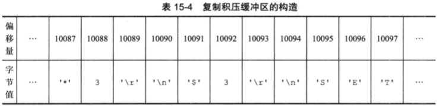

可使用 slaveof 命令让一个服务器成为另一个服务器的从节点。注意，从节点也可以是另一个服务器的主节点。

比如，A 是 B 的主节点，B 是 C 的主节点，即 B 是 A 的从节点，也是 C 的主节点。主从节点并不是绝对的，而是相对的。


Redis 在 2.8 版本之后，优化了复制功能的实现。


## 旧版（2.8之前）复制的实现


复制分为同步和命令传播两个操作。

<!-- - 同步用于将从节点数据库状态更新至主节点数据库状态； -->


### 同步


同步操作通过从节点向主节点发送 SYNC 命令来完成。

主节点收到 SYNC 命令后，执行 BGSAVE 命令（在后台生成 RDB 文件），并使用一个缓冲区记录从现在开始执行的所有写命令。

当主节点当 BGSAVE 命令执行完毕时，主节点将 RDB 文件发送给从节点，从节点接收并载入这个 RDB 文件，将自己的数据库状态更新至主节点执行 BGSAVE 命令时的数据库状态。

主节点将记录在缓冲区里面的所有写命令发送给从节点，从节点执行这些写命令，将自己的数据库状态更新至主节点当前所处的状态。

### 命令传播

主节点会将自己执行的写命令，发送给从节点执行。

### 缺陷

复制分为初次复制和断线后重复制两种情况。

初次复制即从节点以前没复制过主节点，执行全量复制，没有问题。

然而断线后复制，从节点还是会从主节点全量复制，比较低效。
例如，主从节点已经是同步状态，这时主从有 1 秒的断线，重连后，从节点仍需要进行全量复制。


## 新版复制的实现

使用 PSYNC 命令代替 SYNC 命令执行同步操作。

PSYNC 命令具有全量同步和部分同步两种模式。全量同步用于初次复制，部分同步用于断线后复制。

在断线后复制的情况下，主节点将主从服务器连接断开期间执行的写命令发送给从节点，从节点只要接收并执行这些写命令，就可以将数据库更新至主节点当前所处的状态。

PSYNC 命令的部分同步功能解决了旧版复制在断线后重连的低效情况。


部分同步功能由复制偏移量（replication offset)、复制积压（replication backlog）和运行时ID（run ID）实现。


**复制偏移量（replication offset)**


主节点每次向从节点传播 N 个字节的数据时，就将自己的复制偏移量的值加上 N。

从节点每次收到主节点传播来的 N 个字节的数据时，就将自己的复制偏移量的值加上 N。

如果主从节点处于一致状态，那么主从节点的偏移量总是相同的。

**复制积压（replication backlog）**


复制积压是一个主节点维护的固定长度队列。

复制积压保存着一部分最近传播的写命令，并且复制积压会为队列中的每个字节记录相应的复制偏移量。




当从节点重连上主节点时，从节点会通过 PSYNC 命令将自己的复制偏移量发送给主节点，主节点根据这个偏移量决定对从节点执行何种同步操作。

如果复制偏移量之后的数据存在于复制积压里，则主节点对从节点执行部分同步操作；否则执行全量同步操作。

**运行时ID（run ID）**

无论主从服务器，都有自己对运行时ID，运行时ID在启动时生成。

主要用于各服务器之间互相标识。

比如从服务器断线重连时，如果重连后的主服务器 runID 和断线前的主服务器 runID 不同，则要进行全量复制，相同则只需部分复制。

## 复制流程总结

1. 从节点使用 slaveof 命令设置主节点的地址和端口；
2. 主从建立套接字连接；
3. 从节点发送 PING 命令（检查套接字的通信是否正常）；
4. 主从互相进行身份认证（如果主节点设置了 requirepass 选项）；
5. 从向主发送端口信息（便于后续主节点向从节点发送缓冲区命令和命令传播）；
6. 从节点向主节点发送 PSYNC 命令开始同步（全量同步或部分同步）；
7. 完成同步之后，开始命令传播。


## 心跳检测

在命令传播阶段，从节点会以每秒一次的频率，向主节点发送命令：

```
REPLCONF ACK <replication_offset>
```

其中 replication_offset 是从节点当前的复制偏移量。

发送该命令对于主从节点有 3 个作用。

1. 检测主从节点的网络连接状态；
2. 辅助实现 min-slaves 选项（从节点数量是否符合最小要求）；
3. 检测命令丢失（命令丢失后执行部分同步）。