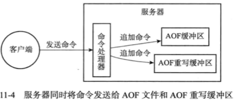

AOF(Append Only File) 是另一种持久化功能。

注意与 RDB 的区别，RDB 通过数据库中的键值对来记录数据库中的键值对来记录数据库状态不同，AOF 则通过保存 Redis 服务器执行的写命令来记录数据库状态。

服务器启动时，载入并执行 AOF 文件中保存的命令来还原服务器数据。

## 基本实现

分为命令追加（append）、文件写入、文件同步（sync）三个步骤。

服务器在执行完一个写命令之后，会以协议格式将被执行的写命令追加到服务器状态的 aof_buf 缓冲区的末尾。

在服务器每次结束一个事件循环之前，redis 都会考虑是否需要将 aof_buf 缓冲区中的内容写入和保存到 AOF 文件里面。
由 redis 服务器配置的 appendfsync 选项值决定。appendfsync 可以配三种策略：

- always：将 aof_buf 缓冲区的所有内容写入并同步到 AOF 文件；
- everysec：将 aof_buf 写入到 AOF 文件，并且距离上次同步超过1秒，就同步，注意这个同步是由一个线程专门执行；
- no：只写入，不同步，何时同步由操作系统决定；

appendfsync 的默认值为 everysec。

---

**文件的写入与同步**

在现代 OS 中，当用户调用 write 函数，将一些数据写入到文件的时候，OS 会将写入数据暂时保存在一个内存缓冲区里。

等到缓冲区的空间被填满，或者超过了指定的时限之后，才真正地将缓冲区中的数据写入到磁盘里面。

---

## AOF 文件的载入

创建一个不带网络连接的伪客户端，用伪客户端执行AOF文件保存的命令。

注意，AOF 载入和 RDB 载入一样，都会阻塞服务器到载入完毕。

## AOF 重写

避免 AOF 文件越来越大。重写后的 AOF 文件不包含任何浪费空间的冗余命令，所以新 AOF 文件体积通常会比旧 AOF 文件的体积要小的多。

AOF 重写不需要读取现有 AOF 文件，完全是通过读取现有服务器状态进行实现。

为了避免 redis 服务器主进程不被 AOF 重写阻塞，AOF 重写由后台子进程进行（BGREWRITEAOF）。

注意，使用的是后台子进程而不是线程，可以在避免使用锁带来的性能损耗，然而不使用锁，就只能使用“双写”技术来保证父进程与子进程的数据一致性。

Redis 为此设置了一个 AOF 重写缓冲区，这个缓冲区在服务器创建子进程之后开始使用。当 redis 服务器执行完一个写命令之后，它会同时将这个写命令发送给 AOF 缓冲区和 AOF 重写缓冲区。

当子进程完成 AOF 重写后，它会向父进程发送一个信号，父进程在接到该信号之后，会调用一个信号处理函数，执行如下工作：

1. 将 AOF 重写缓冲区中的所有内容写入到新 AOF 文件中，这时新 AOF 文件所保存的数据库状态和服务器当前的数据库状态一致；
2. 对新的 AOF 文件进行改名，原子地覆盖现有的 AOF 文件，完成新旧两个 AOF 文件的替换。

在整个 AOF 后台重写过程中，只有上面的信号处理函数会对服务器主进程（父进程）造成阻塞，这将 AOF 重写对服务器性能造成的影响降到了最低。