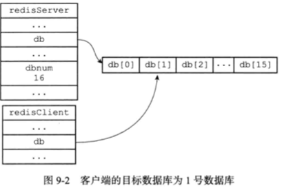

通常一个 redis server 有 16 个数据库，由 dbnum 字段表示。

```c
struct redisServer {
    redisDb *db; // 指向数据库数组
    int dbnum;   // 数据库数量，可配置，默认为 16
    // ... 
};
```

redis client 连接上 server 后默认使用第 0 个数据库，可通过 SELECT 命令选择。




## 数据库键空间

每个数据库其实是一个 kv 数据库实现。

```c
typedef struct redisDb {
    dict *dict;                 /* The keyspace for this DB */
    dict *expires;              /* Timeout of keys with a timeout set */
    dict *blocking_keys;        /* Keys with clients waiting for data (BLPOP) */
    dict *ready_keys;           /* Blocked keys that received a PUSH */
    dict *watched_keys;         /* WATCHED keys for MULTI/EXEC CAS */
    struct evictionPoolEntry *eviction_pool;    /* Eviction pool of keys */
    int id;                     /* Database ID */
    long long avg_ttl;          /* Average TTL, just for stats */
} redisDb;
```

redisDb 中的 dict 字段保存了数据库中的所有 kv 对，这个字典称为键空间（keyspace）。

## 过期时间的设定和过期策略

通过 EXPIRE 、PEXPIRE 、EXPIREAT 和 PEXPIREAT 四个命令，客户端可以给某个存在的键设置过期时间，当键的过期时间到达时，键就不再可用。

这四个命令的底层实现其实都是 PEXPIREAT。


redisDb 中的 expires 字典保存了数据库中所有键的过期时间， 这个字典称为过期字典。

过期字典的每个键是一个指针，指向键空间中的某个对象，过期字典的值是一个毫秒精度的时间戳，代表过期时间。

注意，当某个键过期时，并不会马上从键空间中删除，redis 采用惰性删除+定期删除的策略对过期键进行清理。

- 惰性删除：redis 在执行命令之前，会检查键是否过期，如果过期则会删除键；
- 定期删除：每隔一段时间，对expires字典进行检查，删除里面的过期键。

注意，对于运行在复制模式下的集群来说，由主服务器来控制从服务器统一地删除过期键，以此保证主从服务器数据的一致性。

## AOF、RDB 和复制功能对过期键的策略


生成 RDB 时会检查键是否过期，过期键不会写入 RDB；载入 RDB 时，如果服务器以主模式运行，过期键不会载入到数据库，如果服务器以从模式运行，过期键会载入到数据库。


写入 AOF 时，会对过期键进行过期检查，如果过期会向 AOF 文件写入 DEL 语句；在执行 AOF 重写时，也会对键进行过期检查，过期键不会进行


当服务器运行在复制模式下时，从服务器的过期键删除动作由主服务器控制。
可能会出现主从不同步导致的同一个数据在主服务器过期删除，从服务器还未来得及完成删除操作的情况。