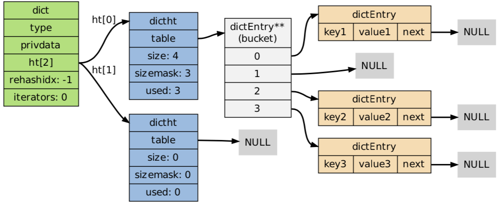
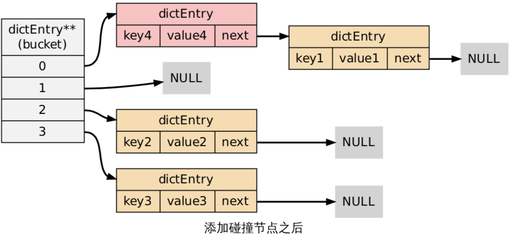

Redis支持五种数据类型：string，list，hashmap，set 及 zset(有序集)。


上面 5 种数据类型由不同的数据结构实现。


| 数据类型 | 实现 |
|--|--|
| string | sds |
| list | 链表 |
| hash | 字典 |

下面依次介绍各实现。


## SDS

全名为 Simple Dynamic String，即简单动态字符串。

Redis 自创的字符串实现。SDS 有 3 个字段：

```C
struct sdshdr {
    unsigned int len;
    unsigned int free;
    char buf[];
};
```

len 用于在 O(1) 的时间获取字符串长度。free 记录 buf 数组中未使用字节的数量。buf 字节数组用于保存字符串。


重点阐述 SDS 与 C 字符串的区别。

1. O(1) 时间复杂度获取字符串长度。

    C 字符串不记录自身的长度信息，所以为了获取一个 C 字符串的长度，必须遍历整个字符串。

2. 杜绝缓冲区溢出。

    C 字符串在执行字符串拼接动作时，src 字符串可能空间不够，导致拼接后的字符串超过原始空间。而 SDS 在拼接之前会检查字符数组是否有足够空间，空间不足时会扩展空间再进行拼接动作。


3. 减少内存分配次数

    SDS 可以知道实际使用长度和剩余空间，在字符串修改时不需要每次都重新分配内存，而 C 字符串则需要。同时使用惰性空间释放未使用空间避免内存释放。

4. 可保存任意格式的二进制数据（二进制安全）

    C 字符串以 '\0' 作为字符串结尾，即在 C 字符串中不可存在 '\0' ，而 SDS 使用字段 len 表示实际长度，即可在 SDS 中存储 '\0' 字符，或者任意二进制数据（图片等）。


## 链表

Redis 中的链表是一个**双向链表**。

```C
// 链表节点
typedef struct listNode {
    struct listNode *prev;
    struct listNode *next;
    void *value;
} listNode;

// 链表
typedef struct list {
    listNode *head;
    listNode *tail;
    void *(*dup)(void *ptr);
    void (*free)(void *ptr);
    int (*match)(void *ptr, void *key);
    unsigned long len;
} list;
```

list 结构体包含 len 字段，可以在 O(1) 时间内获取 list 长度。

## 字典

字典用来实现 redis 中的数据库和哈希键。

而字典是由两个哈希表实现的。

```C
typedef struct dict {
    dictType *type;
    void *privdata;
    dictht ht[2]; // 哈希表
    long rehashidx; // 正常使用（非rehash）时为 -1
    int iterators; // 正在使用哪个ht
} dict;
```


正常情况下只使用一个哈希表，rehash 的过程两个哈希表都要用到，rehash 结束时又只会用到一个哈希表。比如：

1. 正在使用 ht[0]，ht[1]为 null, iterators 为 0;
2. rehash 开始，将 ht[0] 的数据 rehash 到 ht[1];
3. rehash 结束，使用 ht[1], ht[0]为 null，iterators 为 1;




dict 使用链地址法解决键冲突。



注意新加的碰撞键值对加在链表头。

下面重点关注 rehash 过程。

负载因子：

```
ratio = ht[iterators].used / ht[iterators].size
```

**rehash 的触发**

1. 服务器没有在执行 BGSAVE / BGREWRITEAOF 命令，并且负载因子 >= 1;
2. 服务器正在执行 BGSAVE / BGREWRITEAOF 命令，并且负载因子 >= 5;

rehash 并不是一次性、集中式地完成，而是一个渐进过程。


rehash 过程中，字典的删除、查找、更新会在两个哈希表上进行。

例如，对于查找操作，程序会先在 ht[0] 进行查找，如果没找到的话，则会继续到 ht[1] 中进行查找。

注意，对于插入操作，程序只会插入到新的哈希表，这一措施保证了 ht[0] 包含的键值对数量会只减不增，并随着 rehash 操作的执行而最终变成空表。