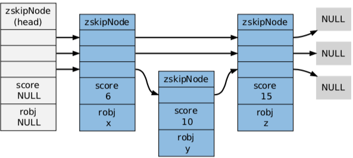
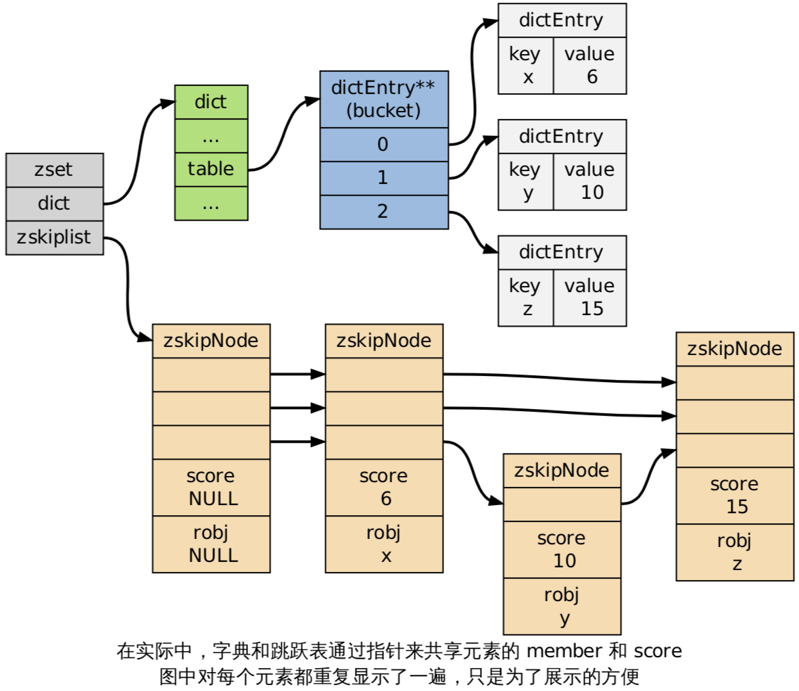

Redis支持五种数据类型：string，list，hashmap，set 及 zset(有序集)。


上面 5 种数据类型由不同的数据结构实现。


| 数据类型 | 实现 |
|--|--|
| string | 整数 / sds |
| list | 压缩列表 / 双向链表 |
| hash | 压缩列表 / 字典 |
| set | 整数集合 / 字典 |
| zset | 压缩列表 / 字典 / 跳跃表 |

下面依次介绍各实现。


## SDS

全名为 Simple Dynamic String，即简单动态字符串。

Redis 自创的字符串实现。SDS 有 3 个字段：

```C
struct sdshdr {
    unsigned int len;
    unsigned int free;
    char buf[];
};
```

len 用于在 O(1) 的时间获取字符串长度。free 记录 buf 数组中未使用字节的数量。buf 字节数组用于保存字符串。


重点阐述 SDS 与 C 字符串的区别。

1. O(1) 时间复杂度获取字符串长度。

    C 字符串不记录自身的长度信息，所以为了获取一个 C 字符串的长度，必须遍历整个字符串。

2. 杜绝缓冲区溢出。

    C 字符串在执行字符串拼接动作时，src 字符串可能空间不够，导致拼接后的字符串超过原始空间。而 SDS 在拼接之前会检查字符数组是否有足够空间，空间不足时会扩展空间再进行拼接动作。


3. 减少内存分配次数

    SDS 可以知道实际使用长度和剩余空间，在字符串修改时不需要每次都重新分配内存，而 C 字符串则需要。同时使用惰性空间释放未使用空间避免内存释放。

4. 可保存任意格式的二进制数据（二进制安全）

    C 字符串以 '\0' 作为字符串结尾，即在 C 字符串中不可存在 '\0' ，而 SDS 使用字段 len 表示实际长度，即可在 SDS 中存储 '\0' 字符，或者任意二进制数据（图片等）。


## 链表

Redis 中的链表是一个**双向链表**。

```C
// 链表节点
typedef struct listNode {
    struct listNode *prev;
    struct listNode *next;
    void *value;
} listNode;

// 链表
typedef struct list {
    listNode *head;
    listNode *tail;
    void *(*dup)(void *ptr);
    void (*free)(void *ptr);
    int (*match)(void *ptr, void *key);
    unsigned long len;
} list;
```

list 结构体包含 len 字段，可以在 O(1) 时间内获取 list 长度。

## 字典

字典用来实现 redis 中的数据库和哈希键。

而字典是由两个哈希表实现的。

```C
typedef struct dict {
    dictType *type;
    void *privdata;
    dictht ht[2]; // 哈希表
    long rehashidx; // 正常使用（非rehash）时为 -1
    int iterators; // 正在使用哪个ht
} dict;
```


正常情况下只使用一个哈希表，rehash 的过程两个哈希表都要用到，rehash 结束时又只会用到一个哈希表。比如：

1. 正在使用 ht[0]，ht[1]为 null, iterators 为 0;
2. rehash 开始，将 ht[0] 的数据 rehash 到 ht[1];
3. rehash 结束，使用 ht[1], ht[0]为 null，iterators 为 1;


dict 使用链地址法解决键冲突。


注意新加的碰撞键值对加在链表头。

下面重点关注 rehash 过程。

负载因子：

```
ratio = ht[iterators].used / ht[iterators].size
```

**rehash 的触发**

1. 服务器没有在执行 BGSAVE / BGREWRITEAOF 命令，并且负载因子 >= 1;
2. 服务器正在执行 BGSAVE / BGREWRITEAOF 命令，并且负载因子 >= 5;

rehash 并不是一次性、集中式地完成，而是一个渐进过程。

渐进式即将 rehash 键值对所需的计算工作均摊到对字典对每个增删改查的操作上，从而避免了集中式 rehash 而带来的庞大计算量。


所以，rehash 过程中，字典的删除、查找、更新会在两个哈希表上进行。

例如，对于查找操作，程序会先在 ht[0] 进行查找，如果没找到的话，则会继续到 ht[1] 中进行查找。

注意，对于插入操作，程序只会插入到新的哈希表，这一措施保证了 ht[0] 包含的键值对数量会只减不增，并随着 rehash 操作的执行而最终变成空表。

**rehash 的具体步骤**

1. 为 ht[1] 分配比 ht[0] 更大的空间（通常是 2 倍）；
2. 将 rehashidx 置为 0，表示 rehash 过程正式开始；
3. 在 rehash 期间，每次对字典增删改查时，还会顺带将 ht[0] 在 rehashidx 索引上的所有键值对 rehash 到 ht[1]，当 rehash 工作完成后，程序将 rehashidx 属性的值增一；
4. 随着字典操作的不断进行，最终在某个时间点上，ht[0] 的所有键值对都会被 rehash 至 ht[1]，这时程序将 rehashidx 属性的值设为 -1，表示 rehash 操作已完成。


## 跳跃表

跳跃表支持平均 O(logN)、最坏 O(N) 复杂度的节点查找，还可以通过顺序性操作来批量处理节点。

在大多数情况下，跳跃表的效率和平衡树相当，并且实现要更为简单，所以很多程序都使用跳跃表代替平衡树。

跳跃表是 zset 的实现方法之一（另一个是压缩列表）。

Redis 只在两个地方用到来跳跃表：一个是有序集合键，一个是在集群节点中用作内部数据结构。

在同一个跳跃表中，各个节点保存的 member 必须是唯一的，但是多个节点保存的 score 却可以是相同的。
所以查找一个元素时需要检查他的 score 和 member。

跳跃表中的节点按照 score 进行排序，当分值相同时，节点按照 member 的大小进行排序。


<!-- 有序集只支持 4 种操作：插入、遍历、按分值遍历、删除

| Command | Description |
|--|--|
| ZADD | Adds member with the given score to the ZSET |
| ZRANGE | Fetches the items in the ZSET from their positions in sorted order |
| ZRANGEBYSCORE | Fetches items in the ZSET based on a range of scores |
| ZREM | Removes the item from the ZSET, if it exists | -->

比如如下有序集：

```
redis> ZADD s 6 x 10 y 15 z
(integer) 3

redis> ZRANGE s 0 -1 WITHSCORES
1) "x"
2) "6"
3) "y"
4) "10"
5) "z"
6) "15"
```

在redis中的数据结构如下：




---

注意，有序集同时使用了字典和跳跃表两种数据结构：

```c
typedef struct zset {
    dict *dict;
    zskiplist *zsl;
} zset;
```

字典用于以 O(1) 的时间查找某个 member 的 score 或者某个 score 有哪些 member，而跳跃表用来执行顺序遍历操作。



---

## 整数集合

整数集合（intset）是集合键的底层实现之一，如果一个集合：
1. 只保存着整数元素;
2. 元素的数量不多;

那么 Redis 就会使用 intset 来保存集合元素。

整数集合是有序的，程序使用二分查找算法来实现查找操作，复杂度为 O(logN)。


## 压缩列表


压缩列表是 redis 为了节约内存而开发的。


是由一系列特殊编码的连续内存块组成的顺序型数据结构。一个压缩列表可以包含任意多个节点，每个节点可以保存一个字节数组或者一个整数值。

由于压缩列表的内存结构，ziplistpush 可能会有连锁更新（cascade update）的动作，连锁更新在最坏情况下复杂度是O(N^2)。

但是不是每次 ziplistpush 都会有连锁更新，所以 ziplistpush 等命令的平均复杂度为 O(N)。

## 对象

对于 redis 的 5 种数据类型（string、list、hash、set、zset）来说，并不会直接使用上面阐述的这些数据结构，而是抽象出一层对象系统。

即 redis 中所有的数据对象都是通过这层对象系统进行封装。对象定义如下：

```c
typedef struct redisObject {
    unsigned type:4;
    unsigned encoding:4;
    unsigned lru:REDIS_LRU_BITS; /* lru time (relative to server.lruclock) */
    int refcount; // 引用计数，redis 使用引用计数法垃圾回收
    void *ptr;
} robj;
```

其中的 type 字段指出了该对象是 5 种数据类型中的哪一种。

```c
/* Object types */
#define REDIS_STRING 0
#define REDIS_LIST 1
#define REDIS_SET 2
#define REDIS_ZSET 3
#define REDIS_HASH 4
```

其中的 type 字段指出了使用的编码方式。

```c
#define REDIS_ENCODING_RAW 0    
#define REDIS_ENCODING_INT 1    
#define REDIS_ENCODING_HT 2     
#define REDIS_ENCODING_ZIPMAP 3 
#define REDIS_ENCODING_LINKEDLIST 4
#define REDIS_ENCODING_ZIPLIST 5
#define REDIS_ENCODING_INTSET 6 
#define REDIS_ENCODING_SKIPLIST 7 
#define REDIS_ENCODING_EMBSTR 8 
```