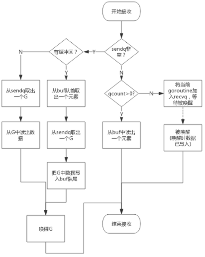

## 字符串


字符串在Go语言内存模型中用一个2字长的数据结构表示。


---

## slice


slice 是一个数组某个部分的引用。是一个包含三个字段的结构体。

第一个字段 ptr 是指向底层数组的某个位置的指针；第二个字段 len 是 slice 引用的长度；第三个字段 cap 是底层数组的剩余空间。

注意，slice 也可以在 slice 的基础上生成，如下的 `b`：

```go
package main

func main() {
	a := make([]int, 2, 5)
	a[0] = 1
	a[1] = 2
	// println(a[2]) // 超过长度就会panic
	b := a[:3]
	println(len(b), cap(b)) // 3 5

	b[2] = 9
	a = append(a, 3) // 这里 a[2] 会覆盖上面的 b[2]
	println(a[2])    // 3
	println(b[2])    // 3

	a = append(a, 4, 5, 6)
	println(len(a), cap(a)) // 6 10 ，a 这里重新分配了底层数组

	println(len(b), cap(b)) // 3 5 ，这里 b 还是用的原来底层数组，和 a 没关系了
	b[2] = 9
	println(a[2]) // 3 ，上面改变 b 就不会再影响 a 了
	println(b[2]) // 9
}
```

注意 slice 在 for-range 的过程中是静态的，即在 for-range 开始的时候就确定了 for-range 的次数：

```go
s := []int{1, 2, 3}
for i, v := range s {
	s = append(s, v*2)
	println(i, v, len(s))
}
```

输出：

```
0 1 4
1 2 5
2 3 6
```

### 扩容

append 时进行。扩容规则：

1. 新大小是当前大小 2 倍以上，则大小增长为新大小；
2. 否则，如果当前大小小于 1024 ，按每次 2 倍增长；
3. 否则，按每次当前大小 1 / 4 增长，直到增长的大小超过或等于新大小。


### new 和 make

new返回一个指向已清零内存的指针，而make返回一个复杂的结构。


---

## map

go 中的 map 是用哈希表实现的。

哈希表实现思路和 redis 中一样。使用两个大表，一个用于增量扩容时使用。

扩容会建立一个大小是原来2倍的新的表，将旧的 bucket 搬到新的表中之后，并不会将旧的 bucket 从 oldbucket 中删除，而是加上一个已删除的标记。

注意，map 在 for-range 的过程中是动态的：

```go
func main() {
	m := make(map[int]int)
	m[1] = 1

	for k, v := range m {
		println(k, v, len(m))
		m[k+1] = v + 1
	}
}
```

输出：


注意每次输出数据不同，这个和哈希表的实现有关。


### 扩容

和 redis 的 rehash 类似，扩容不是一次性完成的，而是一个渐进式的过程。在每次插入或删除时都会进行 1～2 个键值对的搬移，

### 查找过程

主要关注扩容时的查找。


1. 根据 key 值计算出 hash 值；
2. 首先在 old table 中查找，如果已经标记为 evacuated，转到步骤 3，否则返回对应的 value 值；
3. 在 new table 中查找。


### 插入过程

主要关注扩容时的插入。

1. 根据 key 值计算出 hash 值，然后得到对应的 bucket 值；
2. 首先在  old table 中查找，如果已经标记为 evacuated，转到步骤 3，否则将其迁移到 new table，并且标记为 evacuated；
3. 在 new table 中插入。

### 插入与删除的性能

在 go 的 map 实现中，插入的性能比删除好。

插入其实是找到对应的 bucket 后，就直接追加 kv 值，不会管是不是有老值，也就是说在 map 中插入一个值，肯定是会增加一个 kv 对，即使这个 key 已经存在于 map 中。

删除则需要多一些顺序查找找到确切对应的 kv 对，然后进行删除。

---

## nil

在 go 中，任何类型在未初始化时都对应一个零值，指针、函数、interface、slice、channel、map 的零值都是 nil。

### interface

最容易混淆的一个语法：空指针的接口不为空，没有类型的空接口才为空。

比如 error 是 go 中的一个接口，Error 是我们自定义的一个类型，如下代码：

```go
package main

type Error struct{}

func (e *Error) Error() string {
	return ""
}

func main() {
	var err error
	println(err == nil) // true

	var e *Error
	err = e
	println(err != nil) // true
}
```

### slice

前面已经提到 slice 是一个结构体，那么 slice 的空值含义为其中的指针域为空。

也就说一个空slice（空切片）是可以直接取 len() 或者使用 append() 方法的：

```go
package main

func main() {
	var a []int
	println(a == nil) // true
	
	println(len(a))   // 0

	a = append(a, 1)
	println(a[0]) // 1
}
```

### map

map 是指针。但需要注意的是，nil map 可读不可写（会panic)。

---

## channel

channel 和 slice 不同，channel 是一个指针。

channel 使用不当会造成很多 panic，首先是针对 nil channel，读、写、关闭操作都会 panic。

如果不是 nil channel，则根据是否已经关闭，会有不同的 panic 表现：

```go
package main

func main() {
	a := make(chan int, 1)

	close(a)
	println(<-a) // 0, 读取关闭的 channel 会得到一个类型的零值
	println(<-a) // 0
	// a <- 1 // panic: send on closed channel
	// close(a) // panic: close of closed channel
}
```

即对于已经关闭的 channel 来说：

- 向一个已经关闭的 channel 读会得到一个类型的零值，并且可以多次读；
- 向一个已经关闭的 channel 写会 panic；
- 关闭一个已经关闭的 channel 会 panic；


channel 定义：

```go
type hchan struct {
	qcount   uint           // total data in the queue
	dataqsiz uint           // size of the circular queue(环形队列)
	buf      unsafe.Pointer // points to an array of dataqsiz elements
	elemsize uint16
	closed   uint32
	elemtype *_type // element type
	sendx    uint   // send index
	recvx    uint   // receive index
	recvq    waitq  // list of recv waiters
	sendq    waitq  // list of send waiters

	// lock protects all fields in hchan, as well as several
	// fields in sudogs blocked on this channel.
	//
	// Do not change another G's status while holding this lock
	// (in particular, do not ready a G), as this can deadlock
	// with stack shrinking.
	lock mutex // 互斥锁，chan不允许并发读写
}
```

最主要的字段是 buf （环形队列），存放着 channel 中的具体数据。


recvq 和 sendq 中是等待消费和生产的 goroutines。


**因读阻塞的goroutine会被向channel写入数据的goroutine唤醒**，下面是向channel 写数据的过程：


**因写阻塞的goroutine会被从channel读数据的goroutine唤醒**，下面是向channel 读数据的过程：




## context