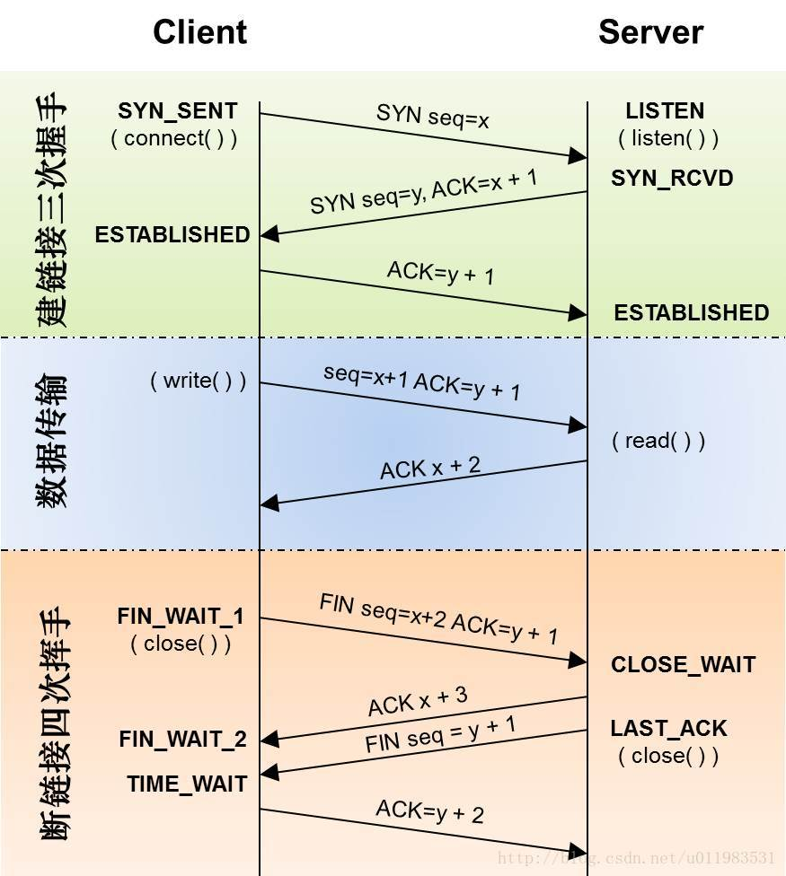

# tcp 基础

一种面向连接的、可靠的、基于字节流的传输层通信协议。


**特征：**

- 面向连接
- 只能点对点（一对一）通信
- 可靠交互
- 全双工通信
- 面向字节流


**如何保证超时传输？**

- 确认和超时重传
    
    当TCP发出一个段后，它启动一个定时器，等待目的端确认收到这个报文段。如果不能及时收到一个确认，将重发这个报文段；

- 数据合理分片和排序
    
    既然TCP报文段作为IP数据报来传输，而IP数据报的到达可能会失序，因此TCP报文段的到达也可能会失序。TCP将对失序数据进行重新排序，然后才交给应用层

- 流量控制
    
    TCP连接的每一方都有固定大小的缓冲空间。TCP的接收端只允许另一端发送接收端缓冲区所能接纳的数据，这可以防止较快主机致使较慢主机的缓冲区溢出(滑动窗口)

- 拥塞控制
    
    防止过多的数据注入到网络中，这样可以使网络中的路由器或链路不致过载。拥塞控制和流量控制不同，前者是一个全局性的过程，而后者指点对点通信量的控制（慢开始、降速（拥塞避免）、快重传、快恢复）

- 数据校验
    
    目的是检测数据在传输过程中的任何变化，若校验出包有错，则丢弃报文段并且不给出响应，这时TCP发送数据端超时后会重发数据


## 三次握手

具体流程：

1. 客户端发送 SYN 给服务器，说明客户端请求建立连接；
1. 服务端收到客户端发的 SYN，并回复 SYN+ACK 给客户端（同意建立连接）；
1. 客户端收到服务端的 SYN+ACK 后，回复 ACK 给服务端（表示客户端收到了服务端发的同意报文）；
1. 服务端收到客户端的 ACK，连接已建立，可以数据传输。
    

## 四次挥手

具体流程：

1. 客户端发送 FIN 给服务器，说明客户端不必发送数据给服务器了（请求释放从客户端到服务器的连接）；
1. 服务器接收到客户端发的 FIN，并回复 ACK 给客户端（同意释放从客户端到服务器的连接）；
1. 客户端收到服务端回复的 ACK，此时从客户端到服务器的连接已释放（但服务端到客户端的连接还未释放，并且客户端还可以接收数据）；
1. 服务端继续发送之前没发完的数据给客户端；
1. 服务端发送 FIN 给客户端，说明服务端发送完了数据（请求释放从服务端到客户端的连接，就算没收到客户端的回复，过段时间也会自动释放），服务端就此进入（LAST-ACK）最后确认状态；
1. 客户端收到服务端的 FIN，并回复 ACK 给客户端（同意释放从服务端到客户端的连接）；
1. 服务端收到客户端的 ACK 后，释放从服务端到客户端的连接。


**TCP 为什么要进行四次挥手？ / 为什么 TCP 建立连接需要三次，而释放连接则需要四次？**

因为 TCP 是全双工模式，客户端请求关闭连接后，客户端向服务端的连接关闭（一二次挥手），服务端继续传输之前没传完的数据给客户端（数据传输），服务端向客户端的连接关闭（三四次挥手）。所以 TCP 释放连接时服务器的 ACK 和 FIN 是分开发送的（中间隔着数据传输），而 TCP 建立连接时服务器的 ACK 和 SYN 是一起发送的（第二次握手），所以 TCP 建立连接需要三次，而释放连接则需要四次


**为什么客户端释放最后需要 TIME-WAIT 等待 2MSL 呢？**

在客户端发送出最后的 ACK 回复，但该 ACK 可能丢失，Server 如果没有收到 ACK，将不断重复发送 FIN 片段。所以客户不能立即关闭，它必须确认服务器接收到了该 ACK。


## 封包 / 解包 / 黏包

TCP 采用字节流的方式，即以字节为单位传输字节序列。那么，我们recv到的就是一串毫无规则的字节流。如果要让这无规则的字节流有规则，那么，就需要我们去定义一个规则。那便是所谓的“封包规则”，将包处理成包头、包体，包头域是定长的，数据域是不定长的。

包头是包的开始标记，整个包的大小就是包的结束标记。接收方只要按同样的方式解包即可。


[黏包问题](https://blog.csdn.net/weixin_41047704/article/details/85340311)

**TCP粘包**就是指发送方发送的若干包数据到达接收方时粘成了一包，从接收缓冲区来看，后一包数据的头紧接着前一包数据的尾。


出现粘包的原因是多方面的，可能是来自发送方，也可能是来自接收方。

发送方可以关闭纳格算法（Nagle算法）解决黏包问题。

>纳格算法，将多次间隔较小、数据量较小的数据，合并成一个数据量大的数据块，然后进行封包。


接收方只能在应用层解决：

循环处理，应用程序从接收缓存中读取分组时，读完一条数据，就应该循环读取下一条数据，直到所有数据都被处理完成，但是如何判断每条数据的长度呢？

格式化数据：每条数据有固定的格式（开始符，结束符），这种方法简单易行，但是选择开始符和结束符时一定要确保每条数据的内部不包含开始符和结束符。

发送长度：发送每条数据时，将数据的长度一并发送，例如规定数据的前4位是数据的长度，应用层在处理时可以根据长度来判断每个分组的开始和结束位置。


**UDP则是面向消息传输的，是有保护消息边界的，接收方一次只接受一条独立的信息，所以不存在粘包问题。**

# udp 基础

一种无连接的传输层协议，提供面向事务的简单不可靠信息传送服务。

**特征：**

- 无连接（无连接即没有双工、单工的概念）
- 尽最大努力交付
- 面向报文
- 没有拥塞控制
- 支持一对一、一对多、多对一、多对多的交互通信
- 首部开销小

# tcp udp 对比

两者对比如下：

- TCP 面向连接，UDP 是无连接的；
- TCP 提供可靠的服务，也就是说，通过 TCP 连接传送的数据，无差错，不丢失，不重复，且按序到达；UDP 尽最大努力交付，即不保证可靠交付
- TCP 的逻辑通信信道是全双工的可靠信道；UDP 则是不可靠信道
- 每一条 TCP 连接只能是点到点的；UDP 支持一对一，一对多，多对一和多对多的交互通信
- TCP 面向字节流（可能出现黏包问题），实际上是 TCP 把数据看成一连串无结构的字节流；UDP 是面向报文的（不会出现黏包问题）
- UDP 没有拥塞控制，因此网络出现拥塞不会使源主机的发送速率降低（对实时应用很有用，如 IP 电话，实时视频会议等）
- TCP 首部开销20字节；UDP 的首部开销小，只有 8 个字节

**基于tcp的常见协议：**

* HTTP / HTTP2

* Websocket

* ARP

    完成网络中其他主机IP地址与物理地址（MAC地址）的映射

* ICMP

    ping 命令

* FTP

    定义了文件传输协议。使用 21 端口。

* Telnet

    一种用于远程登陆的端口，用户可以以自己的身份远程连接到计算机上，通过这种端口可以提供一种基于DOS模式下的通信服务

    使用 23 端口

* SMTP

    定义了简单邮件传送协议，很多邮件服务器都使用该协议发送邮件。使用 25 号端口。

<!-- * POP3
    * 和 SMTP 对应，POP3 用于接收邮件，常用于邮箱客户端程序
    * 只要你有相应的使用 POP3 协议的程序（例如 Fo-xmail 或 Outlook），就可以不以 Web 方式登陆进邮箱界面，直接用邮箱程序就可以收到邮件
    * 使用 110 号端口 -->


**基于udp的常见协议**

* DNS

    用于域名解析服务，将域名地址转换为IP地址。使用 53 号端口。

* SNMP

    简单网络管理协议。使用 161 号端口。

* TFTP

    简单文件传输协议。使用 69 号端口。

# DDOS

Distributed Denial of Service，客户端不断进行请求链接，服务器端会为每个请求创建一个链接，并向其发送确认报文，然后等待客户端进行确认。

说白了就是连接数太高，但服务器又来不及响应，比如客户端qps太高，服务器负载太高响应不了，就类似于DDos。


# Socket 编程

参考 https://www.cnblogs.com/skynet/archive/2010/12/12/1903949.html


**socket 函数**

```c
int socket(int domain, int type, int protocol);
```

创建一个文件描述符 sockfd。
- domain: 协议簇，常用的协议族有，AF_INET、AF_INET6、AF_LOCAL（或称AF_UNIX，Unix域socket）、AF_ROUTE等等
- type：指定socket类型。常用的socket类型有，SOCK_STREAM、SOCK_DGRAM、SOCK_RAW、SOCK_PACKET、SOCK_SEQPACKET等等
- protocol：故名思意，就是指定协议。常用的协议有，IPPROTO_TCP、IPPTOTO_UDP、IPPROTO_SCTP、IPPROTO_TIPC等


**bind 函数**

```c
int bind(int sockfd, const struct sockaddr *addr, socklen_t addrlen);
```

- sockfd：要绑定的文件描述符。
- addr：指向要绑定给sockfd的协议地址。（包括端口号）
- addrlen：对应的是地址的长度。


**listsen 函数**

```c
int listen(int sockfd, int backlog);
```

- backlog: 可以排队的最大连接个数。

**connect 函数**

```c
int connect(int sockfd, const struct sockaddr *addr, socklen_t addrlen);
```

注意这个是客户端函数。

- sockfd 是客户端的socket描述符；
- addr 是服务端的socket地址；

**accept 函数**

```c
int accept(int sockfd, struct sockaddr *addr, socklen_t *addrlen);
```

<!-- TCP客户端依次调用socket()、connect()之后就向TCP服务器发送了一个连接请求。

TCP服务器监听到这个请求之后，就会调用accept()函数取接收请求，这样连接就建立好了。 -->

- sockfd: 服务器的socket描述字，是服务器开始调用socket()函数生成的，称为监听socket描述字；
- addr: 客户端的socket地址；
- 函数返回的是已连接的socket描述字（客户端的socket描数字）；

一个服务器通常通常仅仅只创建一个监听socket描述字，它在该服务器的生命周期内一直存在。

内核为每个由服务器进程接受的客户连接创建了一个*已连接socket描述字（客户端的socket描数字）*，当服务器完成了对某个客户的服务，相应的已连接socket描述字就被关闭。

**read 函数**

```c
ssize_t read(int fd, void *buf, size_t count);
```

read 函数是负责从 fd 中读取内容。

- 当读成功时，read 返回实际所读的字节数。如果返回的值是 0 表示已经读到文件的结束了，小于 0 表示出现了错误。


**write 函数**

```c
ssize_t write(int fd, const void *buf, size_t count);
```

write 函数将 buf 中的 nbytes 字节内容写入文件描述符 fd。

成功时返回写的字节数，失败时返回 -1。


**close 函数**

```c
int close(int fd);
```

close操作只是使相应客户端socket描述字的引用计数-1，只有当引用计数为0的时候，才会触发TCP客户端向服务器发送终止连接请求。


# netstat 命令

展示当前网络状态（network status)的命令。

执行命令显示如下：

```shell
➜ ~ netstat
Active Internet connections
Proto Recv-Q Send-Q  Local Address          Foreign Address        (state)
tcp4       0      0  10.222.76.44.55195     59.111.181.155.https   ESTABLISHED
tcp4       0      0  10.222.76.44.55194     10.255.0.186.ndl-aas   FIN_WAIT_2
tcp4       0      0  10.222.76.44.55193     10.255.0.186.ndl-aas   FIN_WAIT_2
tcp4       0      0  10.222.76.44.55176     mail-m9777.mail..imaps ESTABLISHED
tcp4       0      0  10.222.76.44.55175     10.211.211.35.https    ESTABLISHED
tcp4       0      0  10.222.76.44.55172     117.188.204.221..https ESTABLISHED
```

各列含义如下。

**Proto**

协议名（tcp协议还是udp协议)

**Recv-Q**

网络接收队列（单位：字节）。表示收到的数据已经在本地接收缓冲，但还没有被进程取走。正常情况下应该是 0 。

**Send-Q**
  
网络发送队列（单位：字节）。等待发送的数据，可能是没有发送出的或对方还没有 ACK 的。正常情况下是 0。

**Local Address**

本地监听地址和端口。

0.0.0.0:22表示本地所有ip的22端口；

:::22 也表示本地所有IP的 22 端口（ipv6），::其实是"0:0:0:0:0:0:0:0"的缩写，相当于 IPv6 的"0.0.0.0"；

::1:631 这个表示监听IPv6的回环地址的631端口,::1 这个表示 IPv6 的 loopback 地址；

172.172.230.211:3306 这里我们看到我们的 mysqld 进程监听的是 172.172.230.211 的 3306 端口,这是因为我们在启动的时候指定了 bind_address=172.172.230.211 参数，如果不指定 bind_address 的话，mysqld 默认监听 :::3306(本机所有ip地址的3306端口 -IPv6)

**Foreign Address**

与本机端口通信的外部socket。显示规则与Local Address相同。

**state**

state 中共有 12 种可能的状态，除了 UNKNOWN 之外的 11 种是按照 TCP 的三次握手和四次挥手的过程来描述的。


主要状态如下图示：




**当出现大量 TIME_WAIT 或 CLOSE_WAIT 是什么情况？（面试高频问题）**

- TIME_WAIT 即主动关闭。
    
    要么就是连接的异常，要么就是自己没有快速的回收资源，总之不是由于自己程序错误引起的。

    如果是连接问题，有可能是最后的 ACK 服务端一直没收到，导致服务端一直重发 FIN，则客户端会一直处于 TIME_WAIT 状态。
    
    或者可以通过调整内核参数让处于 TIME_WAIT 状态的连接进行重用，不推荐这么做，tcp 默认给 TIME_WAIT 留 2MSL 时间周期进行彻底关闭回收资源。

- CLOSE_WAIT 即被动关闭。

    当服务端收到第一个 FIN 信号后，就进入 CLOSE_WAIT 状态，表示服务端正在关闭连接。

    如果出现了大量 CLOSE_WAIT，即对方发送一个FIN后，程序自己这边没有进一步发送ACK以确认，换句话说就是在对方关闭连接后，程序里没有检测到，或者程序里本身就已经忘了这个时候需要关闭连接，于是这个资源就一直被程序占用着。

    通常是有bug，需要修复。