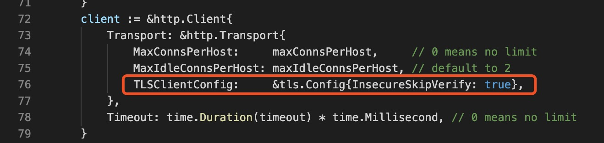
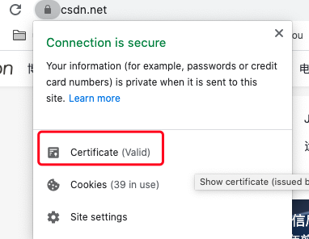
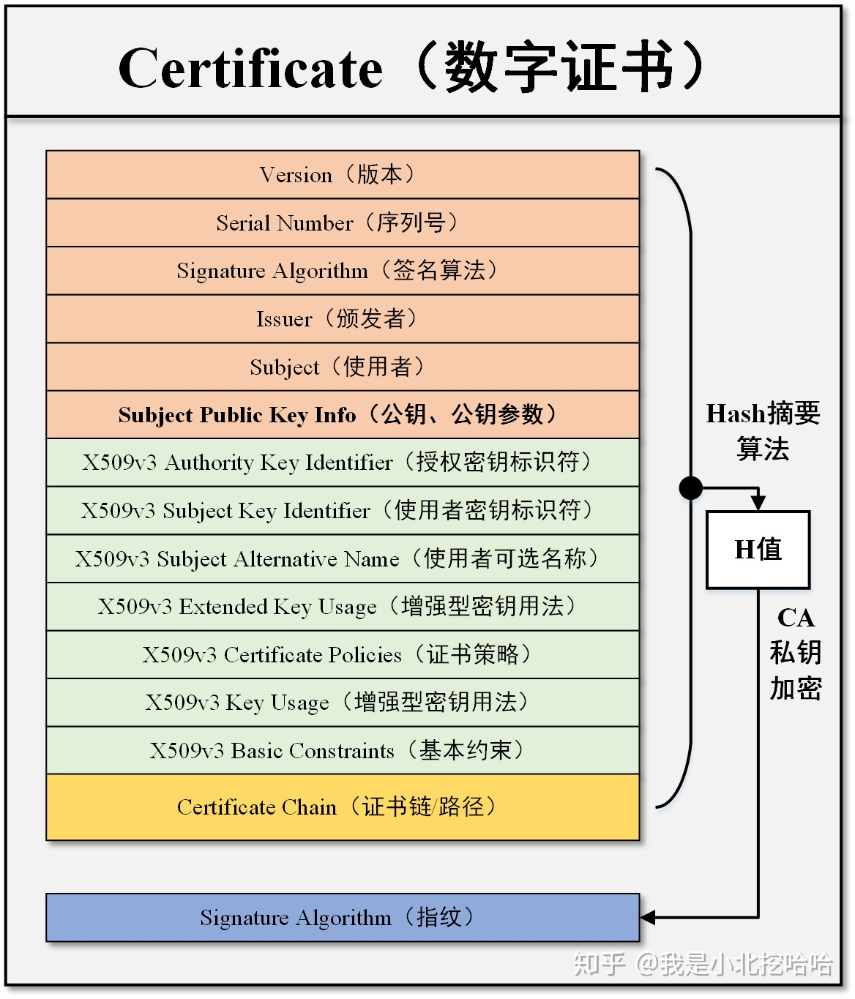
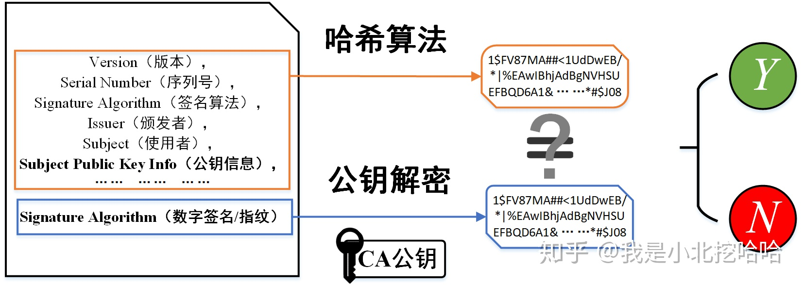
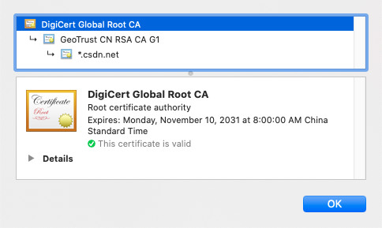
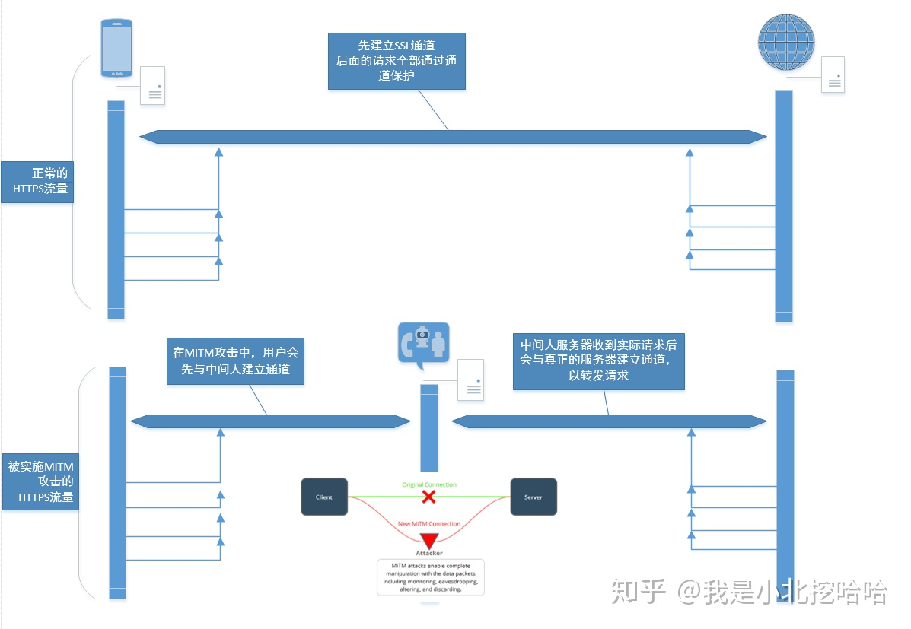

# HTTP

**需要注意的 http-header:**

- Host

    Host 请求头指明了请求将要发送到的服务器主机名和端口号。能够使不同域名配置在同一个IP地址的服务器上。

    所有HTTP/1.1 请求报文中必须包含一个该头字段。否则可能会收到400（Bad Request）状态码。

    示例：
    ```
    Host: developer.cdn.mozilla.net
    ```


- Connection

    决定当前的事务完成后，是否会关闭网络连接。

    如果该值是“keep-alive”，网络连接就是持久的，不会关闭，使得对同一个服务器的请求可以继续在该连接上完成，这是 HTTP/1.1 请求的默认值。


    如果该值是“close”，表明客户端或服务器想要关闭该网络连接，这是 HTTP/1.0 请求的默认值。


- Content-Length

    指明发送给接收方的消息主体的大小。


- If-Match

    表示这是一个条件请求。

    ```
    If-Match: <ETag>

    If-Match: "123456"
    ```
    
    服务器会对比 If-Match 的字段值和资源的 ETag 值，仅当两者一致时，才会执行请求。反之，则返回状态 412 (Precondition Failed，先决条件失败) 的响应。


**需要注意的状态码：**

- 499

    nginx 自定义的状态码，并非 http 标准。

    意即 “client has closed connection”，客户端请求等待链接已经关闭，这很有可能是因为服务器端处理的时间过长。


# HTTPS

针对 https 直接看一段代码：




该代码意即请求 HTTPS 站点，然该站点的证书并非通过权威 CA 认证，所以跳过证书验证。


## 证书简介

通常证书即指数字证书、(CA)证书、HTTPS证书、SSL/TLS证书，直接点说就是CA签发的数字证书。

数字证书=主体信息+数字签名。

数字证书通常由四部分组成。由打开 chrome 打开一个可信赖的站点，可以看到证书：



打开证书顶部会看到证书连，即由根证书到该证书的颁发链条。

其次会看到 Subject(使用者)、Issuer(颁发者，即颁发该证书的 CA)、PublicKeyInfo(公钥信息)、Fingerprints(数字签名)四个部分。

注意该证书由 CA 颁发，即最后的数字签名由 CA 生成。

CA 生成数字签名的规则如下：



>有些地方的描述提到了“摘要”，即上面非签名部分，将“摘要”计算hash指之后再用 ca 私钥加密，得到签名。


该签名即一个防伪标识，在证书验证阶段能够确保“防伪”。

## 证书验证

在客户端与服务端建立 HTTPS 连接时，服务端会向客户端返回证书。

客户端收到对端发过来的证书需要进行证书验证，用于验证客户端从服务端拿到的证书是合法的，从而能够验证服务端的身份。

具体过程图示如下：



1. 客户端拿到证书后对其“摘要”进行哈希映射，得到的散列值记作 H1；
2. 从系统内置的 CA 颁发的真实证书中取出数字签名，然后使用 CA 的公钥对数字签名进行解密，得到的散列值记作 H2；
3. 对比H1和H2两个字符串是否严格相等，若是，代表该证书的信息未被篡改，证书有效；否则，证书内容被篡改，证书无效；
4. 若证书有效，客户端会拿**证书上的公钥（也是对端自己生产的非对称加密公钥**加密接下来整个TLS握手阶段的信息之后，发送给对端。

注意上面出现了两个公钥，一个是CA公钥，一个是证书上的公钥，两者不同。

**CA机构的公钥怎么获取？**

提前内置。操作系统和浏览器在软件安装阶段会在其特定目录下放置一堆的证书。

这些证书中有一类特别的证书是根证书，根证书上的公钥即上文提到的 CA 公钥。在服务端返回的证书中，有一部分是颁发链条，颁发链条的顶端就是根证书。



## 后果

若跳过证书验证阶段，则可能会出现中间人攻击的情况。




也就是说一开始的代码存在一定的攻击风险。


# HTTP2

传输数据爆炸增长（文本为主=>富媒体为主），不得不给 HTTP 更新换代。

HTTP2 是一个二进制协议，可读性几乎为0。

术语：

- Stream：一个双向流，一条连接可以有多个 streams；
- Message：也就是逻辑上面的 request，response；
- Frame：数据传输的最小单位。每个 Frame 都属于一个特定的 stream 或者整个连接。一个 message 可能由多个 frame 组成。


主要新特性如下：

1. 帧传输

    放弃原来 “header + body” 的报文结构，替换为数个小片的二进制帧（Frame）。二进制相比于纯文本协议解析起来更高效。

    ```
    +-----------------------------------------------+
    |                 Length (24)                   |
    +---------------+---------------+---------------+
    |   Type (8)    |   Flags (8)   |
    +-+-------------+---------------+-------------------------------+
    |R|                 Stream Identifier (31)                      |
    +=+=============================================================+
    |                   Frame Payload (0...)                      ...
    +---------------------------------------------------------------+
    ```

    Length：也就是 Frame 的长度，默认最大长度是 16KB，如果要发送更大的 Frame，需要显式地设置 max frame size；

    Type：Frame 的类型，譬如有 DATA，HEADERS，PRIORITY 等；

    Flag 和 R：保留位；

    Stream Identifier：流标识，标识所属的 stream；
    
    Frame Payload：根据不同 Type 有不同的格式；

    
    每个数据流都以消息（Message）的形式发送，而消息又由一个或多个帧组成。多个帧之间可以乱序发送，根据帧首部的流标识可以重新组装。

1. 多路复用

    一条连接可以包含多个 streams，多个 streams 发送的数据互相不影响。

    并行的请求能在同一个连接中处理，移除了 HTTP1.x 中顺序和阻塞的约束。

    为了更大的提高一条连接上面的 stream 并发，可以考虑调大 SETTINGS_MAX_CONCURRENT_STREAMS。

    注意，虽然一条连接上面能够处理多个请求，但一条连接远远是不够的。一条连接通常只有一个线程来处理，所以并不能充分利用服务器多核的优势。同时，每个请求编解码还是有开销的，所以用一条连接还是会出现瓶颈。

1. 流优先级

    因为一条连接允许多个 streams 在上面发送 frame，那么在一些场景下面，可以给 stream 分配优先级，优先加载重要的资源。

1. 流量控制

    TCP 的流量控制针对一个连接，而 HTTP2 可以针对某个 stream 进行流量控制。


1. 头部压缩

    开发了专用的 HPACK 压缩算法。
    
    维护一个首部表来跟踪和存储之前发送的键值对（table），首部表在连接存续期间内始终存在，由客户端服务端共同渐进更新。

    发送请求的时候，只要指定某个 header field 在table中的索引，双方就知道要发送的 field 值。


1. 服务器推送

    允许服务器在客户端缓存中填充数据。服务器不再是完全被动的响应请求，也可以新建“流”主动向客户端发送消息。

    比如在浏览器刚请求HTML的时候就提前把可能会用到的JS、CSS文件发给客户端，减少等待的延迟。

    客户端也有权利选择是否接收，推送的资源必须是经过双方确认才行。


# GRPC

gRPC 是 Google 基于 HTTP/2 以及 protobuf 的

gRPC 通常有四种模式，unary，client streaming，server streaming 以及 bidirectional streaming。


参考：
- https://github.com/Frank588/go-https
- https://zhuanlan.zhihu.com/p/105232920
- https://pingcap.com/blog-cn/grpc/