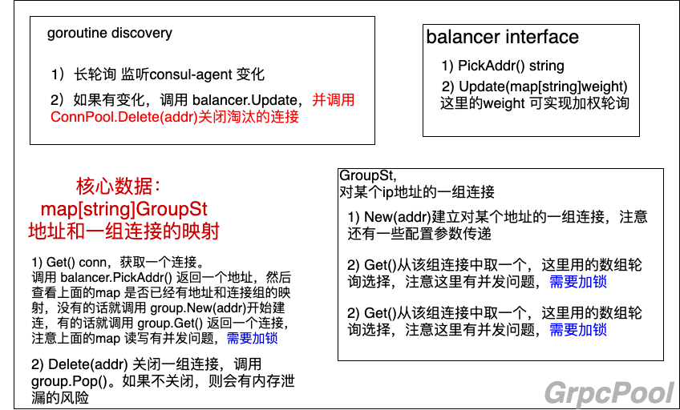
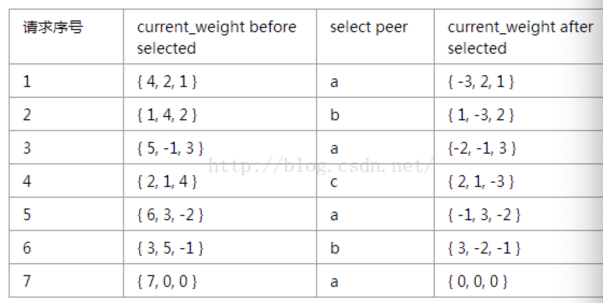

项目里使用 consul + grpc 的方式实现了连接池：



上面有几个点重点关注：

1. 长轮询是什么？

    consul-agent 的接口。

2. 普通轮询？

    ```go
    nextIndex := (l.index + 1) % l.lbList.Size()
    ```

3. 加权轮询是什么？

    平滑加权轮询。

    使用的三方库 https://github.com/smallnest/weighted

    leetcode 收录 https://leetcode-cn.com/problems/random-pick-with-weight/

    也可参考博客 https://blog.csdn.net/larry_zeng1/article/details/80407745

    

    简化后的代码如下：

    ```go
    package main

    type Item struct {
        Val    string
        Weight int

        curWeight int
    }

    func nextSmoothWeighted(items []*Item) (best int) {
        n := len(items)
        if n == 0 {
            return -1
        }

        best = -1
        total := 0

        for i := 0; i < n; i++ {
            item := items[i]
            total += item.Weight

            item.curWeight += item.Weight
            if best < 0 || item.curWeight > items[best].curWeight {
                best = i
            }
        }
        items[best].curWeight -= total
        return
    }

    func main() {
        items := []*Item{
            {"a", 4, 0},
            {"b", 2, 0},
            {"c", 1, 0},
        }

        for i := 0; i < 10; i++ {
            best := nextSmoothWeighted(items)
            println(items[best].Val)
        }
    }
    ```

4. 并发问题怎么解决？

    有两个锁，一个是 map[string]GroupSt 读写加锁，一个是 Group 内部数组结构读写加锁。


[redigo](https://github.com/gomodule/redigo) 的实现使用了管道计数当前活跃连接。在每次调用 Get 的时候返回一个活跃连接（如果有空闲连接就返回空闲连接，否则初始化一个连接，即惰性加载一个连接），然后在调用完毕后，调用 conn.Close 可以把这个活跃连接还给连接池，变成空闲连接。


redigo 中的空闲连接使用的双向链表存储连接
- 当活跃连接关闭时，在空闲链表头部进行 push_front()，此时会检查是否超过设置的空闲连接数，如果超过的话会对最老的空间连接进行淘汰
- 当链表不空取连接时，在头部进行取连接 pop_front()
- 在每次调用 Get 连接的时候，会对过期的过期连接进行淘汰，由于链表是根据时间顺序从头往后 push 的，所以会在尾部进行 pop_back()，将过期的连接关掉


---

Golang http 包的长连接怎么实现？

通过 http 包下的 transport.go/ transport.roundTrip(req *Request) 文件实现。

该方法分两步：

1. getConn 

    1) 如果有空间连接，则直接返回 transport.queueForIdleConn

        空闲连接的维护使用两个数据结构：

        idleConn 是一个链表，维护着空闲连接，其中的每个元素是 persistConn 类型，取连接在尾部取，还回去也在尾部还（和redigo中在头部取、头部还类似）

        同时还有一个 idleLRU，在还连接的时候，如果达到空闲连接数的上限的话，会淘汰掉最久未使用的那个连接 idleLRU.removeOldest

        之所以这里不能直接使用堆而使用 idleLRU，是因为在取空闲连接的时候还需调用 idleLRU.remove(pconn)，这里的 remove 方法也是 O(1) 


    2）否则进行拨号 transport.dialConn ，拨号的时候会启动两个goroutine
        
        go pconn.readLoop() 和 go pconn.writeLoop() 分别用于读响应和写请求

        注意在 pconn.readLoop() 中会在读完毕后，将连接还给空闲列表


2. 步骤1返回一个 persistConn，简称 pc，执行 pc.roundTrip